# HS Quality — QualitéDomicile

**Présentation d'avancement complète — 2026-05-13**

Plateforme SaaS multi-tenant française pour la qualité et la QVCT des structures d'aide et de soins à domicile (SAAD · SSIAD · SPASAD · ESAD · CCAS · Mandataires).
*Référence produit : CDC-QUALITE-DOM-2024-v2.0 (Février 2024).*

---

## Table des matières

1. [Résumé exécutif](#1-résumé-exécutif)
2. [Glossaire — abréviations & termes métier](#2-glossaire--abréviations--termes-métier)
3. [Pourquoi ce produit (contexte & cadre légal)](#3-pourquoi-ce-produit-contexte--cadre-légal)
4. [Architecture globale](#4-architecture-globale)
5. [Présence publique — site marketing](#5-présence-publique--site-marketing)
6. [Authentification & sécurité d'accès](#6-authentification--sécurité-daccès)
7. [Les 6 rôles — vue d'ensemble](#7-les-6-rôles--vue-densemble)
8. [Rôle 1 — Platform Admin](#8-rôle-1--platform-admin-super-administrateur-plateforme)
9. [Rôle 2 — Dirigeant de structure](#9-rôle-2--dirigeant-de-structure)
10. [Rôle 3 — Coordinateur / Responsable de secteur](#10-rôle-3--coordinateur--responsable-de-secteur)
11. [Rôle 4 — Référent qualité](#11-rôle-4--référent-qualité-tier-pro)
12. [Rôle 5 — Responsable RH / Formation](#12-rôle-5--responsable-rh--formation-tier-pro)
13. [Rôle 6 — Intervenant à domicile](#13-rôle-6--intervenant-à-domicile)
14. [Modules transverses](#14-modules-transverses)
15. [Workflows & machines à états](#15-workflows--machines-à-états)
16. [Sécurité approfondie & conformité](#16-sécurité-approfondie--conformité)
17. [Modèle commercial](#17-modèle-commercial)
18. [Stack technique consolidée](#18-stack-technique-consolidée)
19. [Roadmap & état d'avancement](#19-roadmap--état-davancement)
20. [Comptes de démonstration](#20-comptes-de-démonstration)
21. [Take-aways](#21-take-aways)

---

## 1. Résumé exécutif

| Quoi | Détail |
|------|--------|
| **Produit** | SaaS multi-tenant pour la qualité, la traçabilité et la QVCT en aide à domicile |
| **Cibles** | 6 types de structures françaises (SAAD/SSIAD/SPASAD/ESAD/CCAS/Mandataires) |
| **Différenciateurs** | Préparation HAS native · QVCT anonymisé · audit log par défaut · multi-tenant strict · mobile offline-first |
| **Architecture** | 1 backend Laravel 12 + 2 frontends (Inertia/React web · React Native mobile) |
| **Sécurité** | TOTP obligatoire · row-level tenancy · audit log · HDS Paris/OVH · chiffrement KMS |
| **Tiers** | Essentiel 8 €/intervenant · Pro 15 € · Premium 25 € — essai gratuit 30 j |
| **Stade** | Phase 1 (MVP) livrée · Phase 2 (Pro/Qualité+QVCT) livrée backend, frontend en finalisation · Pilote externe sous peu |
| **Captures** | 50 captures Playwright dans `docs/presentation/screenshots/` |

---

## 2. Glossaire — abréviations & termes métier

### Acteurs sectoriels & instances

| Sigle | Signification |
|-------|---------------|
| **ARS** | Agence Régionale de Santé — autorité de tutelle régionale, exige la traçabilité des interventions et est destinataire des notifications d'incidents graves |
| **HAS** | Haute Autorité de Santé — pilote l'évaluation externe quinquennale obligatoire des structures médico-sociales |
| **AFNOR** | Association Française de Normalisation — édite la norme **NF X50-056** (référentiel qualité spécifique aide à domicile) |
| **ISO** | International Organization for Standardization — la **norme ISO 9001:2015** sert de référentiel qualité générique |
| **ANSSI** | Agence Nationale de la Sécurité des Systèmes d'Information — recommandations cyber appliquées à la santé |
| **CNIL** | Commission Nationale Informatique et Libertés — autorité RGPD française |
| **OPCO** | Opérateur de Compétences — finance la formation continue ; reçoit nos exports d'attestations |
| **CDC** | Conseil Départemental — finance partiellement les bénéficiaires GIR 1-4 (allocation APA) |
| **APA** | Allocation Personnalisée d'Autonomie — versée par le CDC, déclenche la couverture financière des SAAD |

### Types de structure (le top-level tenant)

| Sigle | Signification |
|-------|---------------|
| **SAAD** | Service d'Aide et d'Accompagnement à Domicile — non-médical (ménage, repas, aide à la toilette) |
| **SSIAD** | Service de Soins Infirmiers à Domicile — soins infirmiers prescrits, supervision médicale |
| **SPASAD** | Service Polyvalent d'Aide et de Soins à Domicile — combinaison SAAD + SSIAD |
| **ESAD** | Équipe Spécialisée Alzheimer à Domicile — équipes spécialisées rattachées à un SSIAD |
| **CCAS** | Centre Communal d'Action Sociale — service municipal souvent multi-site |
| **Mandataire** | Prestataire indépendant opérant sous mandat de la structure |

### Concepts clés métier

| Terme | Signification |
|-------|---------------|
| **Bénéficiaire** | Personne aidée à son domicile — équivalent du « patient » dans le médical |
| **Intervenant** | Personnel terrain qui visite les bénéficiaires (aide à domicile, AVS, AES, AS, IDE) |
| **Tournée** | Suite chronologique d'interventions d'un intervenant sur une journée |
| **Intervention** | Visite singulière au domicile d'un bénéficiaire — check-in, tâches, rapport, check-out |
| **Plan d'accompagnement (CarePlan)** | Document listant les tâches récurrentes prévues pour un bénéficiaire (fréquence, durée, responsable) |
| **GIR** | Groupe Iso-Ressources — classification 1–6 du niveau de dépendance (1 = très dépendant, 6 = autonome) |
| **Habilitation** | Autorisation légale d'exécuter un acte de soin précis pour un intervenant |
| **DEAVS** | Diplôme d'État d'Auxiliaire de Vie Sociale (certification professionnelle) |
| **AES** | Accompagnant Éducatif et Social (diplôme remplaçant le DEAVS depuis 2016) |
| **ADVF** | Assistant De Vie aux Familles (titre professionnel d'État) |
| **CQP** | Certificat de Qualification Professionnelle (certification de branche) |
| **Incident / EI** | Événement indésirable (chute, agression, erreur médicamenteuse, maltraitance, situation de danger) |
| **5 pourquoi** | Méthode d'analyse de cause racine — questionner « pourquoi » successivement 5 fois |
| **PAC** | **Plan d'Amélioration Continue** — actions correctives suite à un audit, un incident ou un signal QVCT |
| **QVCT** | **Qualité de Vie et des Conditions de Travail** — successeur de la QVT, obligation employeur |
| **RPS** | **Risques Psychosociaux** — stress, surcharge, conflits, harcèlement (composantes de la QVCT) |
| **Signal faible** | Indicateur précoce détecté avant qu'un risque ne devienne incident (baisse de moral, surcharge, etc.) |
| **Baromètre** | Campagne récurrente de questionnaire QVCT — réponses **anonymes** au niveau collecte |
| **Cartographie RPS** | Heat-map des risques psychosociaux par équipe/secteur |
| **Référentiel** | Grille d'évaluation (HAS, ISO 9001, NF X50-056, ou interne) |
| **Auditeur** | Personne qui conduit un audit interne ou externe |
| **Écart** | Non-conformité identifiée lors d'un audit — qualifié mineur / majeur / critique |
| **Conformité** | Pourcentage d'items respectés dans une grille d'audit |

### Technique / produit

| Sigle | Signification |
|-------|---------------|
| **SaaS** | Software as a Service — application livrée en mode hébergé multi-tenant |
| **HDS** | Hébergement de Données de Santé — certification obligatoire de l'hébergeur (AWS Paris, OVHcloud France) |
| **RGPD** | Règlement Général sur la Protection des Données — base légale UE du traitement de données perso |
| **MFA** | Multi-Factor Authentication — authentification à plusieurs facteurs |
| **TOTP** | Time-based One-Time Password (RFC 6238) — le 6-chiffres généré par Google Authenticator/Authy |
| **Sanctum** | Bibliothèque Laravel — émet des tokens d'API pour l'app mobile |
| **Fortify** | Bibliothèque Laravel — gère l'auth web (login, password reset, MFA) |
| **Inertia** | Pont SPA-côté-serveur — React parle à Laravel sans REST API frontend |
| **Wayfinder** | Plugin qui génère des fonctions TypeScript typées depuis les routes Laravel |
| **Reverb** | Serveur WebSocket Laravel — temps réel sans Pusher |
| **Cashier** | Wrapper Laravel pour Stripe — abonnements, webhooks, factures |
| **Pennant** | Feature flags par utilisateur/structure |
| **Pest** | Framework de test PHP (alternative moderne à PHPUnit) ; utilisé exclusivement ici |
| **Scramble** | Génère l'OpenAPI 3 depuis les Form Requests Laravel |
| **Echo** | Client JS pour s'abonner aux canaux Reverb |
| **RBAC** | Role-Based Access Control — modèle de permissions par rôle |
| **CSRF** | Cross-Site Request Forgery — token requis pour toute écriture web |
| **CSP** | Content-Security-Policy — header HTTP qui restreint les origines exécutables |
| **HSTS** | HTTP Strict Transport Security — force le navigateur à utiliser HTTPS |
| **SSE-KMS** | Server-Side Encryption avec Key Management Service AWS |
| **EXIF** | Métadonnées des photos (GPS, appareil, date) — strippées par sécurité avant stockage |
| **PWA** | Progressive Web App — site web installable et utilisable offline |
| **MRR / ARR** | Monthly / Annual Recurring Revenue — métrique SaaS clé |
| **N+1** | Anti-pattern de requête (charger en boucle au lieu d'eager-loader) |
| **Idempotence** | Une opération qui peut être rejouée sans effet supplémentaire (sync mobile, webhooks Stripe) |
| **Soft-delete** | Suppression logique (champ `deleted_at`) qui préserve l'historique |
| **Audit log** | Trace immuable de chaque écriture (qui, quand, avant/après) — assuré par owen-it/laravel-auditing |
| **Multi-tenancy** | Une seule app sert plusieurs clients (« tenants »), avec isolation stricte de leurs données |
| **Global scope** | Filtre Eloquent appliqué automatiquement à toutes les requêtes d'un modèle |

---

## 3. Pourquoi ce produit (contexte & cadre légal)

Une structure d'aide à domicile en France doit, en parallèle, satisfaire **trois obligations distinctes** :

1. **Traçabilité opérationnelle** — chaque intervention doit être documentée (intervenant, horaires, tâches, écarts). L'ARS peut demander cette traçabilité à tout moment dans le cadre d'un contrôle.
2. **Démarche qualité certifiée** — l'évaluation externe HAS est obligatoire tous les 5 ans (Loi du 2 janvier 2002, rénovée 2022). Pour la passer, il faut une démarche structurée alignée sur le **référentiel HAS** ou sur **NF X50-056 / ISO 9001:2015**.
3. **Surveillance QVCT** — depuis 2022 (Accord National Interprofessionnel et Code du travail), tout employeur doit suivre les **Risques Psychosociaux (RPS)** et tenir un Document Unique d'Évaluation des Risques. Le secteur de l'aide à domicile présente un taux de burnout particulièrement élevé.

**Le constat terrain** : aujourd'hui, ces obligations sont gérées via du papier, des fichiers Excel disparates, et des outils RH déconnectés. La preuve qualité (preuves HAS, registres d'incidents, suivi des actions correctives) est dispersée, et le RPS n'est presque jamais suivi correctement.

**Notre proposition** : un seul outil qui unifie ces trois obligations, en alignement strict avec le **CDC-QUALITE-DOM-2024-v2.0**.

---

## 4. Architecture globale

```
┌─────────────────────────────────────────────────────────────────────┐
│                          UTILISATEURS                                │
├─────────────────────┬───────────────────┬──────────────────────────┤
│  Bureau (4 rôles)   │  Terrain          │  Famille / bénéficiaire  │
│  Dirigeant, Coord., │  Intervenant      │  (Phase 3)               │
│  Qualité, RH        │                   │                          │
├─────────────────────┼───────────────────┼──────────────────────────┤
│  Inertia + React    │  React Native     │  Portail PWA séparé      │
│  Tailwind v4 · TS   │  Offline-first    │                          │
└──────────┬──────────┴────────┬──────────┴──────────────────────────┘
           │                   │
           │ Sessions Fortify  │ Sanctum tokens
           ▼                   ▼
┌─────────────────────────────────────────────────────────────────────┐
│                  LARAVEL 12 BACKEND (PHP 8.2+)                       │
│                                                                       │
│  ┌────────────────────────────────────────────────────────────────┐ │
│  │  app/Services/* — LOGIQUE MÉTIER PARTAGÉE (zéro duplication)   │ │
│  │  InterventionService · IncidentService · AuditService ·         │ │
│  │  QvctService · BeneficiaireService · BillingService …          │ │
│  └─────────────┬──────────────────────┬───────────────────────────┘ │
│                │                      │                              │
│       ┌────────▼────────┐    ┌───────▼─────────┐                    │
│       │ Inertia ctrls   │    │ /api/v1/*       │                    │
│       │ (web admin)     │    │ Sanctum + OpenAPI│                   │
│       └─────────────────┘    └─────────────────┘                    │
│                                                                       │
│  • Row-level multi-tenancy (BelongsToStructure global scope)         │
│  • Policy + Form Request validation à chaque écriture                │
│  • Audit log automatique (owen-it/laravel-auditing)                  │
│  • Reverb WebSocket pour le temps réel                               │
│  • Pennant pour les feature flags                                    │
└──────────┬──────────────────────────┬───────────────────────────────┘
           │                          │
           ▼                          ▼
┌────────────────────┐    ┌────────────────────────────────────────────┐
│  PostgreSQL 16     │    │  Stockage & messageries                    │
│  + Redis 7 cache   │    │  · S3 SSE-KMS (HDS Paris) — photos, docs   │
│  · Audits table    │    │  · Redis — file de jobs + cache 5 min      │
│  · structures FK   │    │  · Stripe — abonnements & factures         │
└────────────────────┘    │  · Sentry — erreurs                        │
                          │  · Python ML (Phase 3) — IA prédictive     │
                          └────────────────────────────────────────────┘
```

**Principes directeurs** :

- **Un seul moteur, deux interfaces** — le service `app/Services/*` est appelé indifféremment par le contrôleur Inertia et le contrôleur API. Aucune duplication possible.
- **Sécurité par défaut** — toute écriture passe par : tenant scope → Policy → Form Request `authorize()` → service métier → audit log.
- **Test cross-tenant obligatoire** — chaque modèle métier doit avoir un test Pest qui crée deux structures, requête depuis l'une vers l'autre, et assert que zéro ligne ne fuit. Le test est bloquant en CI.
- **Background jobs idempotents** — toute opération > 200 ms va en queue Redis ; chaque job porte le `structure_id` et peut être rejoué sans effet supplémentaire.

---

## 5. Présence publique — site marketing

Avant même l'authentification, la plateforme expose un site marketing complet, pensé pour le commercial et le SEO.

### 5.1 Page d'accueil


Hero "La qualité ne se déclare pas. Elle se mesure." + statistiques clés (–15 % incidents an 1, > 60 % PAC complétés, < 5 j résolution incident) + témoignage client + mentions HDS / RGPD / HAS / ISO 9001 / TLS 1.3. Le ton est mesuré et orienté preuve.

### 5.2 Page Fonctionnalités

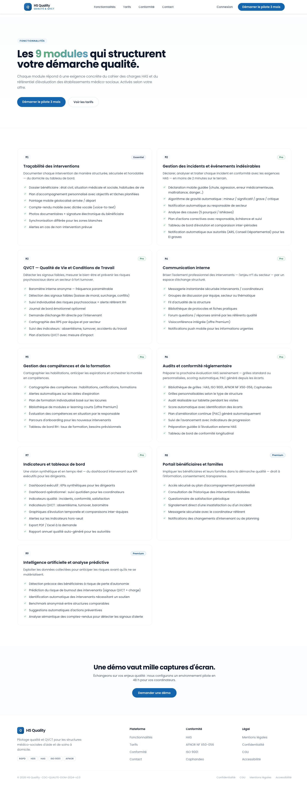

Détail des modules par tier (Essentiel / Pro / Premium), avec icônes par module, descriptions et bénéfices attendus. Sert aux prospects à se positionner sur l'offre adaptée à leur taille.

### 5.3 Page Conformité

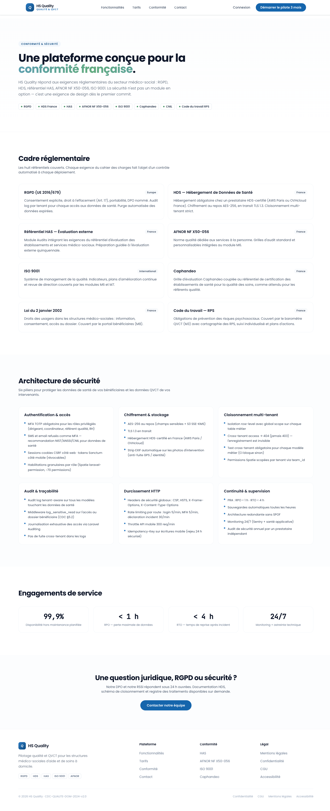

Engagement sécurité & conformité : HDS, RGPD, anonymisation QVCT, audit log, chiffrement à plusieurs niveaux. C'est la page qu'on envoie au DSI ou au délégué RGPD du prospect.

### 5.4 Page de connexion

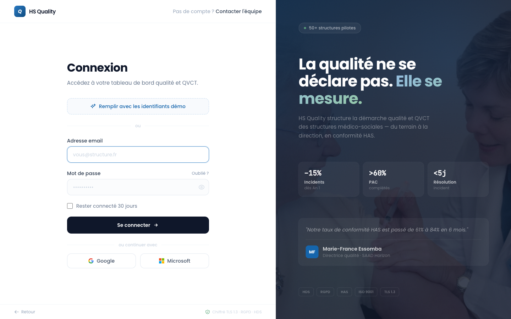

Connexion avec champs e-mail/mot de passe, lien "Oublié ?", checkbox "Rester connecté 30 jours", bouton "Remplir avec les identifiants démo" (utile en démo commerciale), SSO Google et Microsoft prévus. Mentions sécurité visibles en bas de page.

---

## 6. Authentification & sécurité d'accès

### 6.1 Le flux d'authentification

```
1. /login (email + mot de passe)
       ↓
2. Fortify valide → vérifie le rôle
       ↓
3. Si rôle bureau (Dirigeant/Coord./Qualité/RH) :
   • Première connexion → /dashboard/profile/mfa-setup (enrôlement TOTP obligatoire)
   • Connexions suivantes → /two-factor-challenge (code 6 chiffres)
4. Si Intervenant → MFA facultatif (UX terrain, biométrie mobile recommandée)
5. Redirection vers /dashboard (ou /admin pour le Platform Admin)
6. Session 2 h d'inactivité par défaut
```

### 6.2 Mon profil

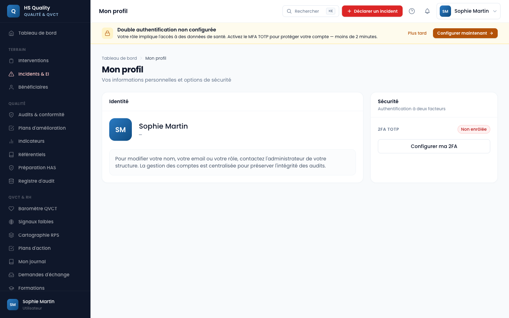

L'utilisateur peut éditer ses infos personnelles (prénom, nom, e-mail), changer son mot de passe (avec confirmation), accéder au sous-menu MFA et Sessions.

### 6.3 Configuration MFA (TOTP)

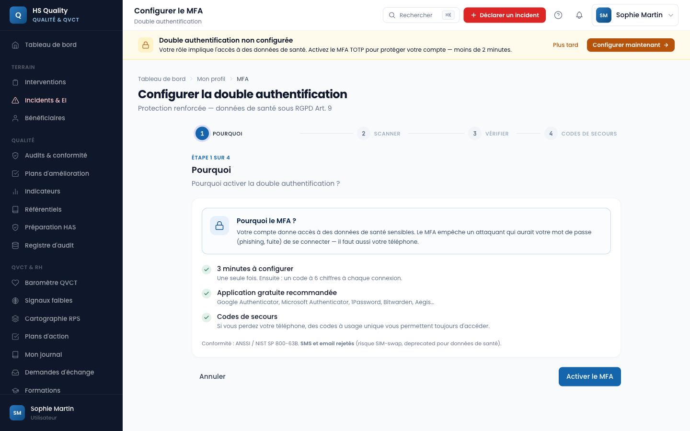

QR code à scanner avec Google Authenticator, Authy, ou 1Password. La validation se fait en saisissant un premier code TOTP. **Codes de récupération** générés à la fin pour les cas de perte du téléphone. **SMS et email OTP explicitement refusés** sur cette plateforme — risque SIM-swap et recommandations ANSSI/CNIL santé.

### 6.4 Sessions actives

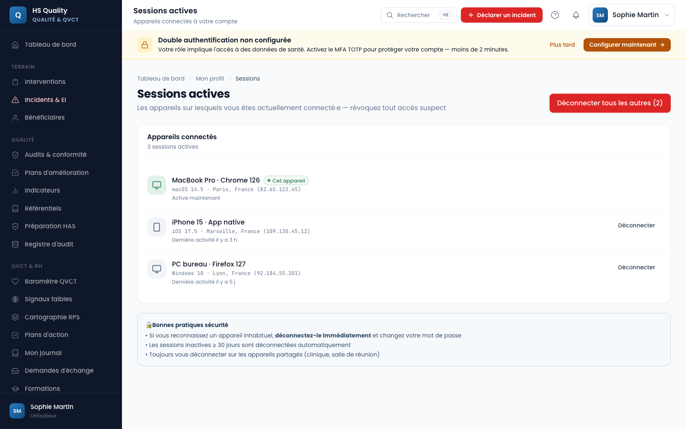

Liste des navigateurs/devices connectés (IP, user-agent, dernière activité). L'utilisateur peut révoquer une session à distance — utile en cas de perte d'appareil ou de suspicion de compromission.

### 6.5 Onboarding nouvel utilisateur

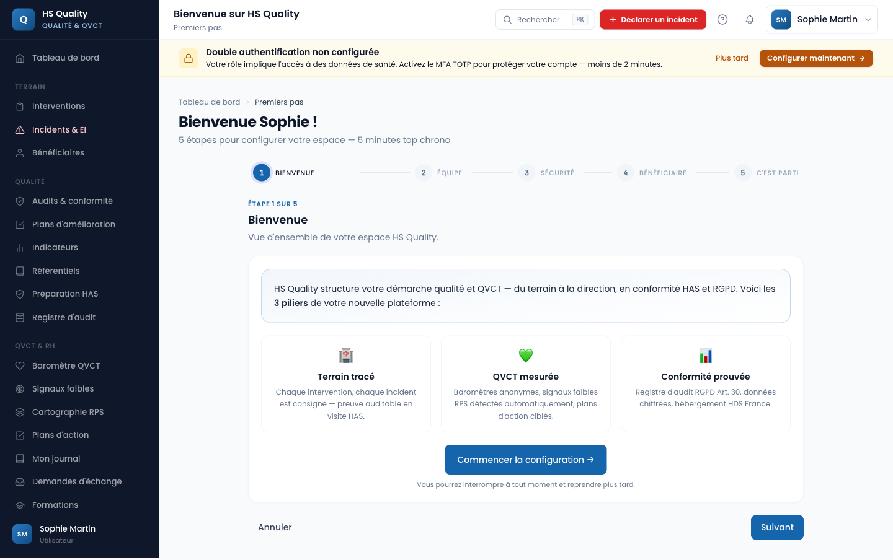

Quand un nouveau compte est créé (par invitation), l'utilisateur passe par cet écran qui le guide pas-à-pas : compléter son profil, configurer MFA, choisir ses notifications, faire le tour du produit.

### 6.6 Registre d'audit (visible Dirigeant + Référent qualité)

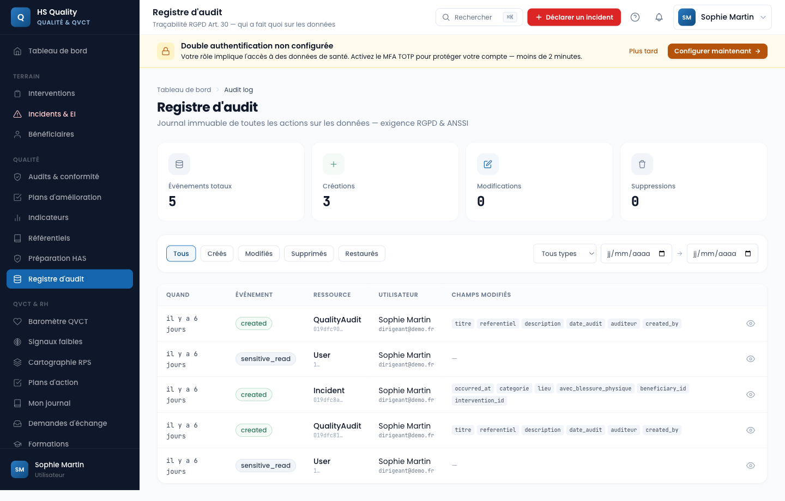

Historique exhaustif de toutes les écritures sensibles : qui a fait quoi sur quel enregistrement, quand, IP source. Filtrable par utilisateur, action, modèle, période. C'est la **preuve de gouvernance** demandée par les auditeurs HAS et par la CNIL en cas de contrôle.

---

## 7. Les 6 rôles — vue d'ensemble

### 7.1 Matrice synthétique

| Rôle | MFA | Env. principal | Périmètre |
|------|-----|---------------|-----------|
| **Platform Admin** | Oui | `/admin` | Hors tenant — supervise toutes les structures |
| **Dirigeant** | Obligatoire | Web admin | Tout sur sa structure + facturation + config |
| **Coordinateur** | Obligatoire | Web admin | Bénéficiaires, interventions, incidents, planning |
| **Référent qualité** | Obligatoire | Web admin | Audits, PAC, préparation HAS |
| **Responsable RH** | Obligatoire | Web admin | Habilitations, certifications, formations, QVCT |
| **Intervenant** | Optionnelle | Mobile RN (+ web restreint) | Sa tournée, ses incidents, son profil |

### 7.2 Matrice des permissions principales (extrait)

| Action / Rôle | Plateforme | Dirigeant | Coord. | Qualité | RH | Intervenant |
|--------------|:---:|:---:|:---:|:---:|:---:|:---:|
| Voir toutes les structures | ✅ | — | — | — | — | — |
| Modifier facturation / tier | — | ✅ | — | — | — | — |
| Inviter utilisateur | — | ✅ | ✅ | — | — | — |
| Créer bénéficiaire | — | ✅ | ✅ | — | — | — |
| Voir tous bénéficiaires structure | — | ✅ | ✅ | ✅ | ✅ | — |
| Voir SES bénéficiaires (assignés) | — | — | — | — | — | ✅ |
| Créer plan d'accompagnement | — | ✅ | ✅ | — | — | — |
| Check-in/out intervention | — | — | — | — | — | ✅ |
| Déclarer incident | — | ✅ | ✅ | ✅ | ✅ | ✅ |
| Analyser incident (5-pourquoi) | — | ✅ | ✅ | ✅ | — | — |
| Lancer audit HAS/ISO/AFNOR | — | ✅ | — | ✅ | — | — |
| Générer PAC | — | ✅ | — | ✅ | — | — |
| Préparer dossier HAS | — | ✅ | — | ✅ | — | — |
| Lancer campagne QVCT | — | ✅ | — | ✅ | ✅ | — |
| Voir signaux faibles RPS | — | ✅ | — | ✅ | ✅ | — |
| Répondre questionnaire QVCT | — | — | — | — | — | ✅ |
| Voir cartographie RPS | — | ✅ | — | ✅ | ✅ | — |
| Gérer habilitations | — | ✅ | — | — | ✅ | — |
| Gérer certifications | — | ✅ | — | — | ✅ | — |
| Créer session formation | — | ✅ | — | — | ✅ | — |
| Voir registre d'audit | — | ✅ | — | ✅ | — | — |

---

## 8. Rôle 1 — Platform Admin *(super-administrateur plateforme)*

> **Compte démo** : `admin@platform.fr` · mot de passe `password` · MFA obligatoire en production.

C'est notre rôle interne, hors tenant. Il est le seul à voir l'ensemble des structures clientes. Sert au support, à la supervision technique et au pilotage commercial.

### 8.1 Console plateforme

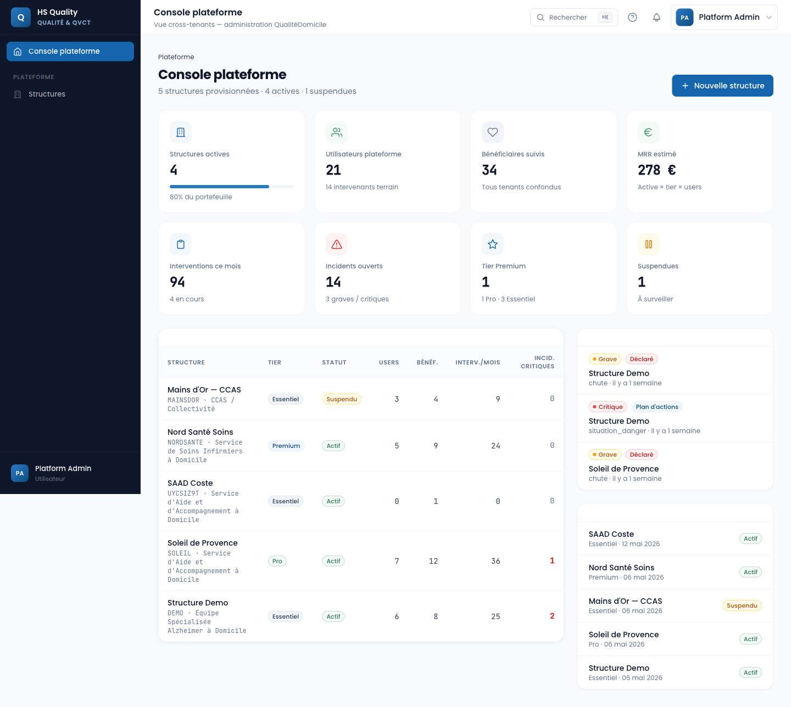

Vue agrégée multi-tenant : nombre de structures actives, intervenants connectés, incidents critiques en cours, MRR. Sert d'observatoire commercial + santé technique de la plateforme.

### 8.2 Gestion des structures

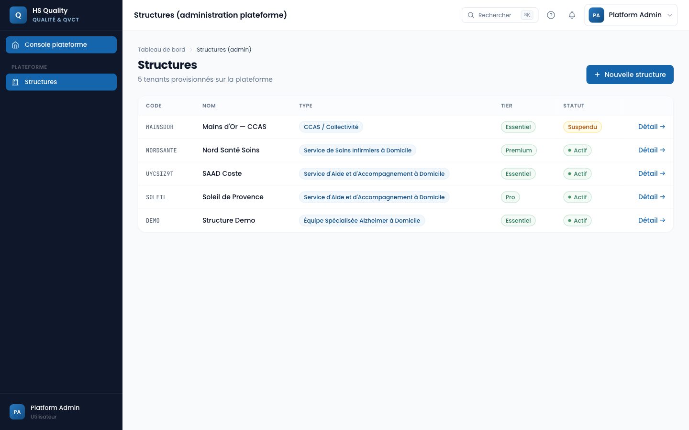

Liste de toutes les structures avec leur type, tier, statut (actif / en essai / suspendu / annulé), nombre d'utilisateurs, nombre d'incidents critiques. Filtrage par type, tier, statut. Le seed propose actuellement 4 structures (DEMO, Soleil de Provence, Nord Santé Soins, Mains d'Or — dont une suspendue).

### 8.3 Provisionnement d'une nouvelle structure

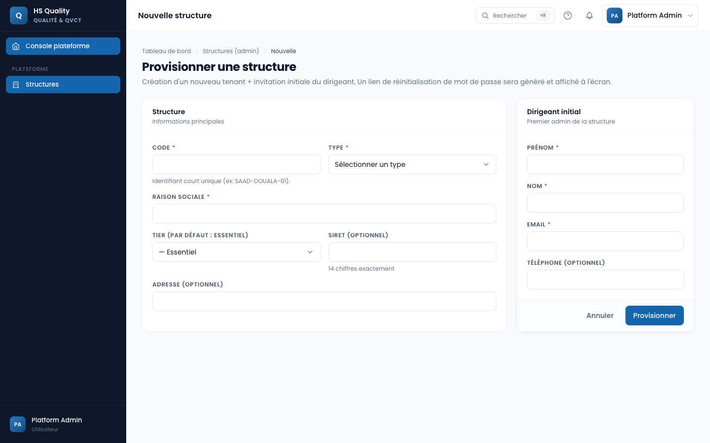

Formulaire de provisionnement : SIRET, nom, type, tier, e-mail du dirigeant. À la soumission, le système crée la structure, invite le dirigeant par e-mail (lien limité dans le temps), lui attribue le rôle `dirigeant`, et déclenche l'essai de 30 jours via Stripe Cashier.

### 8.4 Fiche détaillée d'une structure (vue interne)

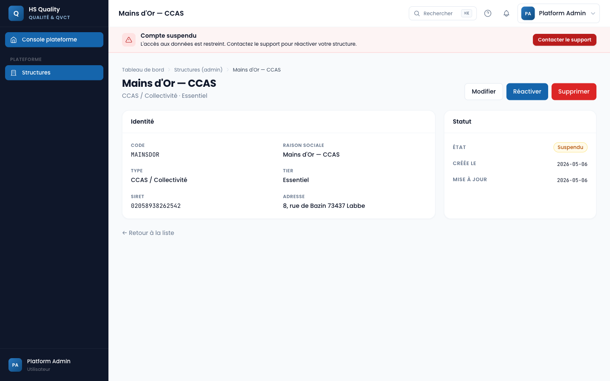

Permet au support d'investiguer une structure spécifique : KPI internes, historique de facturation, ticket support, utilisateurs, incidents critiques. Suspension ou réactivation depuis cette vue (en cas de défaut de paiement par exemple).

---

## 9. Rôle 2 — Dirigeant de structure

> **Compte démo** : `dirigeant@demo.fr` (Sophie Martin) · `password` · MFA TOTP obligatoire.

Le directeur ou directrice de la structure. Permissions opérationnelles maximales + facturation + configuration. Responsable de la stratégie qualité globale.

### 9.1 Tableau de bord exécutif

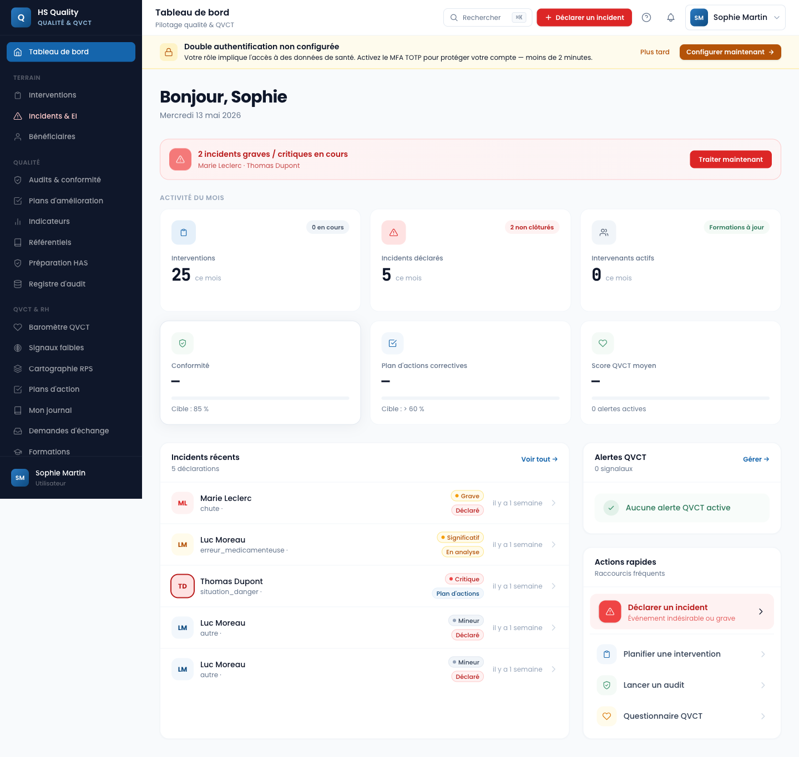

Vue stratégique : KPI du mois (interventions, incidents ouverts, score de conformité, score QVCT), alertes (certifications à expirer, incidents graves, intervenants sans tournée), évolution sur 12 semaines. Cache Redis 5 min, invalidation à chaque écriture pertinente.

### 9.2 Indicateurs qualité

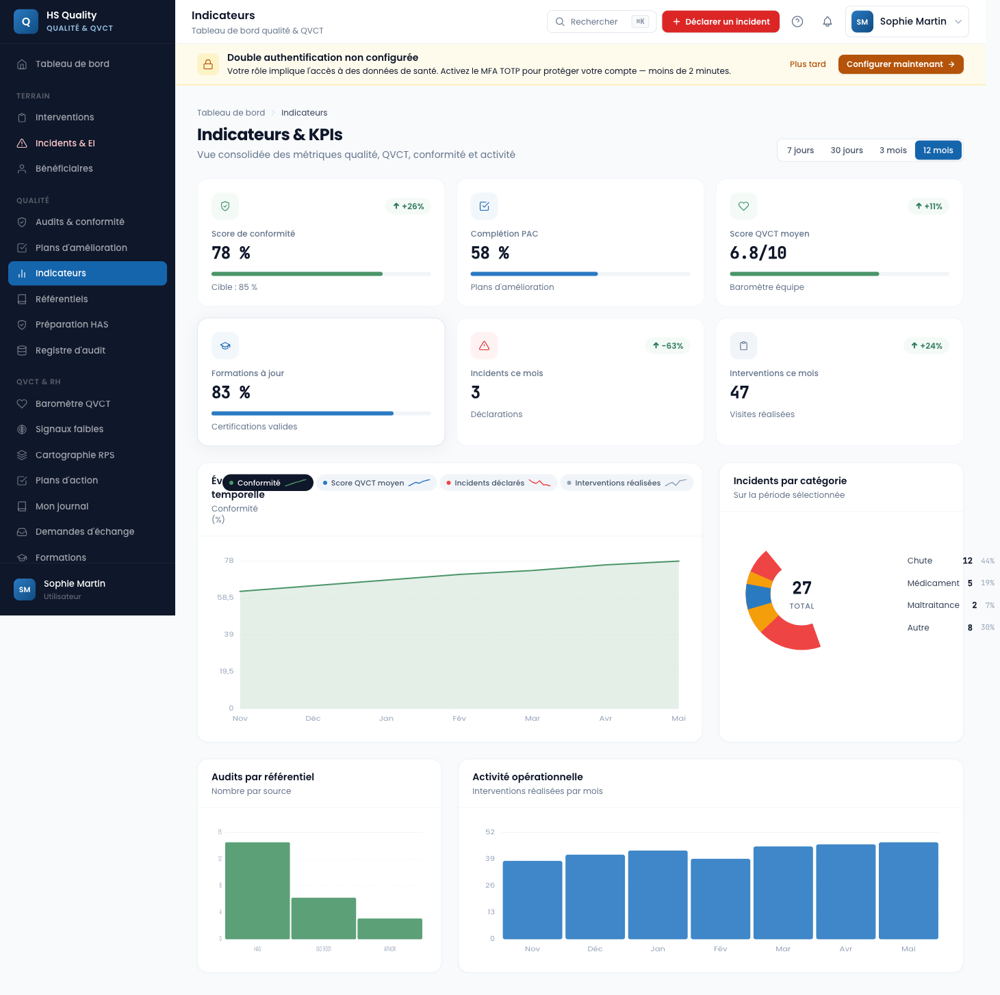

Tendances long-terme par indicateur sectoriel obligatoire : taux d'absentéisme (% heures perdues), turnover annuel, accidents du travail (par 1000 h travaillées), score baromètre QVCT (moyenne mobile), indice de surcharge perçue. Saisie manuelle ou calcul automatique depuis les données plateforme (turnover ← événements de désactivation utilisateur).

### 9.3 Gestion des utilisateurs

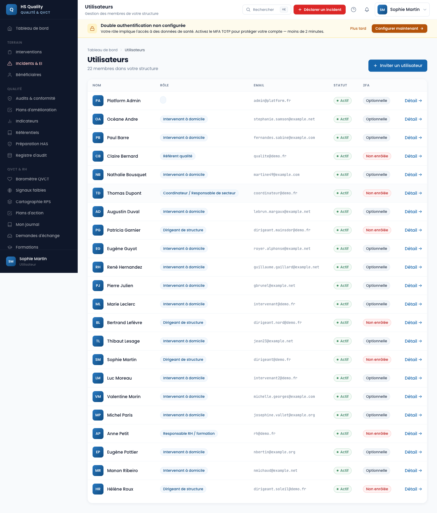

Invitation par e-mail avec un lien de mise en place de mot de passe (expiration 24h), attribution / changement de rôle, désactivation (soft-delete préservant l'historique), affichage du statut MFA, dernière connexion. Le Dirigeant ne peut pas se rétrograder lui-même tant qu'il est le seul Dirigeant — protection anti lock-out.

### 9.4 Paramètres de la structure

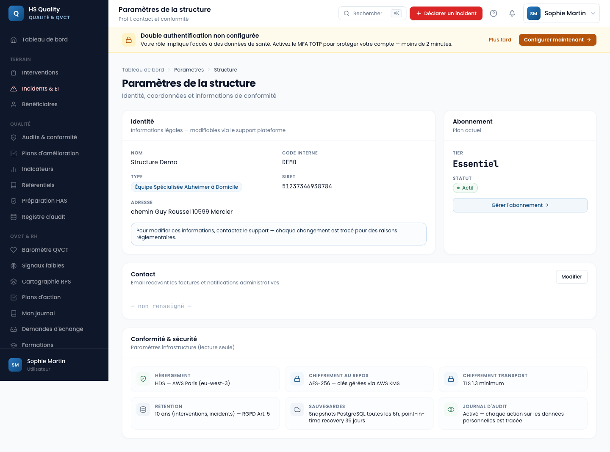

Informations légales : SIRET, nom, adresse, e-mail de facturation, téléphone. Configuration opérationnelle : durée d'essai par défaut pour les nouveaux utilisateurs, préférences de notification, fuseau horaire.

### 9.5 Abonnement & facturation

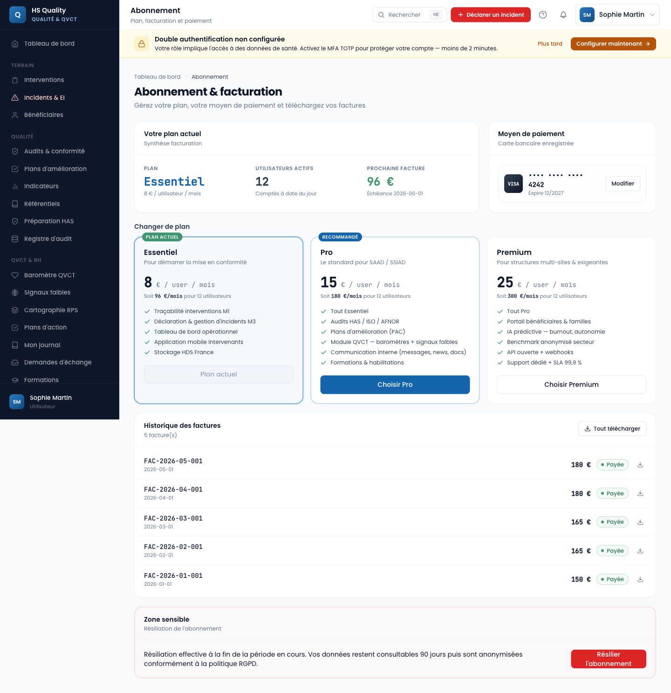

Tier actuel, prix par siège, nombre d'intervenants actifs (= nombre de sièges payés), statut Stripe (trialing / active / past_due / canceled), prochaine date de facturation, factures téléchargeables en PDF. Upgrade / downgrade en self-service. Annulation = bascule en grace period jusqu'à fin de période, puis 30 jours de rétention avant purge.

### 9.6 Mon profil


Identique pour tous les rôles bureau — c'est ici qu'on configure son MFA et qu'on consulte ses sessions actives.

### 9.7 Registre d'audit


Le Dirigeant peut auditer toutes les actions sensibles sur sa structure : qui a modifié quel bénéficiaire, qui a supprimé quel utilisateur, qui a déclassifié un incident. Élément exigible en évaluation HAS et par la CNIL.

---

## 10. Rôle 3 — Coordinateur / Responsable de secteur

> **Compte démo** : `coordinateur@demo.fr` (Thomas Dupont) · `password` · MFA obligatoire.

Le manager opérationnel — il pilote au quotidien les tournées, les bénéficiaires de son secteur, et les incidents. Pas d'accès à la conformité ni à la facturation.

### 10.1 Liste des bénéficiaires

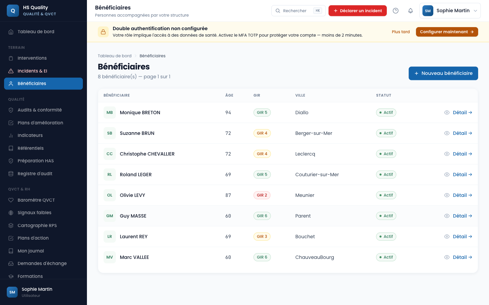

Liste recherchable et filtrable : nom, date de naissance, GIR, intervenant assigné, dernière intervention, statut. Filtres par GIR, par statut (actif / suspendu / archivé), par intervenant. Quick actions : voir, éditer, nouvelle intervention.

### 10.2 Création d'un bénéficiaire

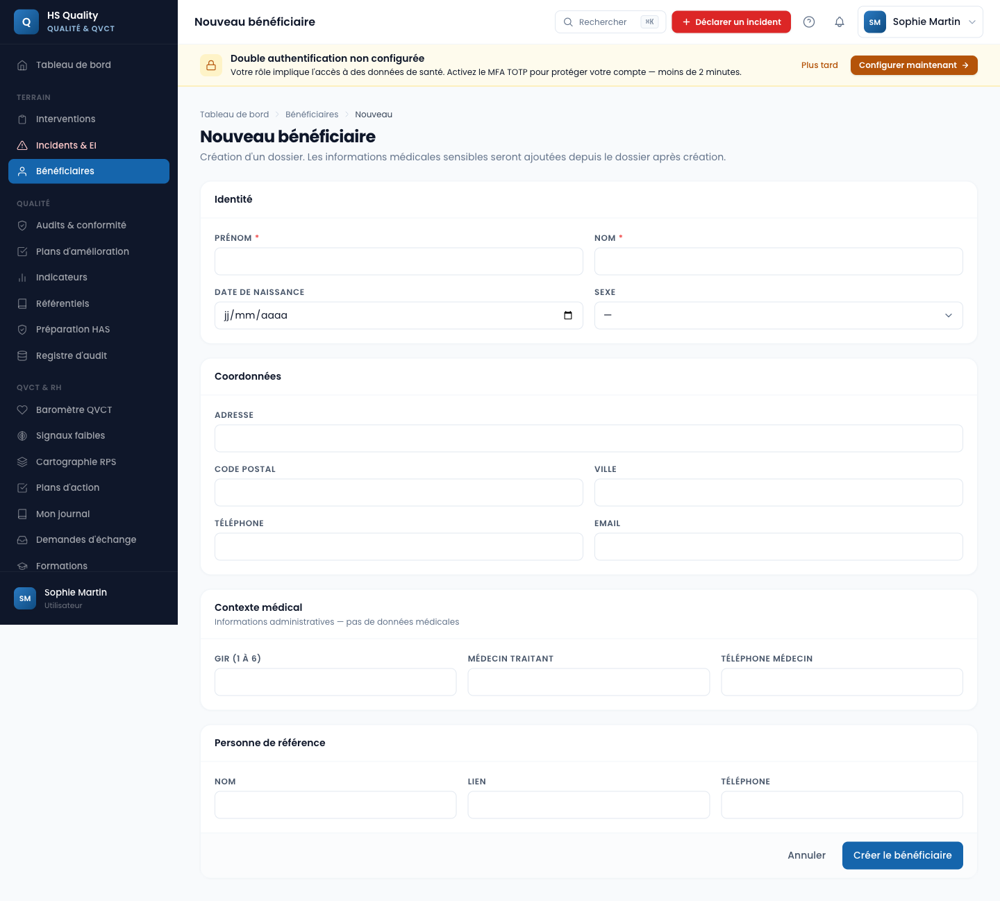

Formulaire complet : informations personnelles (nom, prénom, date de naissance, adresse, téléphone, situation familiale), volet clinique (GIR 1–6, médecin traitant, contact d'urgence), champs sensibles **chiffrés au repos** (notes médicales, allergies, instructions de soin spécifiques). Consentement RGPD horodaté à la création.

### 10.3 Fiche bénéficiaire (vue détaillée)

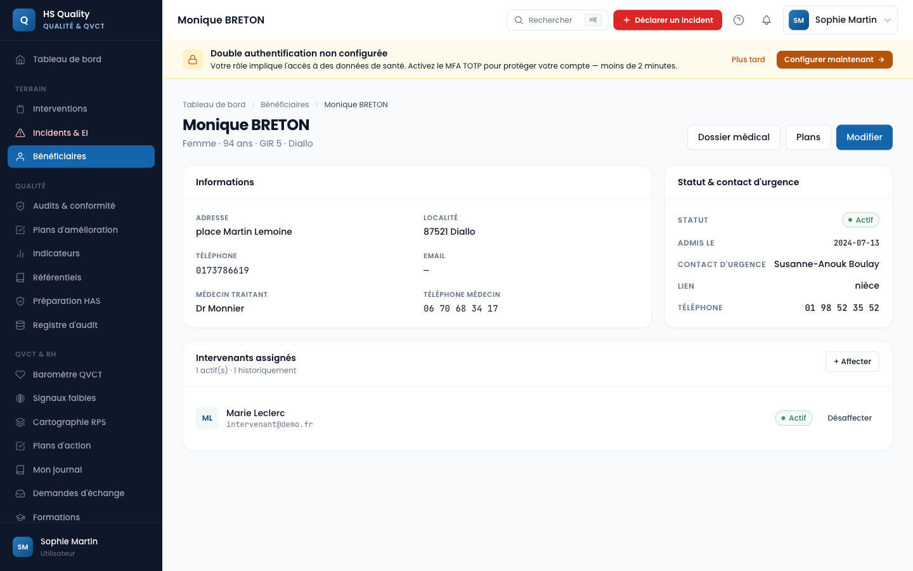

Vue tabulée :
- **Informations** — données perso et cliniques en lecture, bouton Éditer
- **Plan d'accompagnement** — tâches récurrentes (toilette, repas, médication, mobilité, entretien) avec fréquence, durée, intervenant responsable. **Versionné** : éditer crée une nouvelle version, l'ancienne est archivée et reste consultable.
- **Interventions** — historique chronologique avec filtre par date, intervenant, statut
- **Incidents** — incidents liés à ce bénéficiaire, filtrables
- **Documents** — pièces du dossier (prescriptions, évaluations, autorisations) avec versioning

### 10.4 Planning des interventions

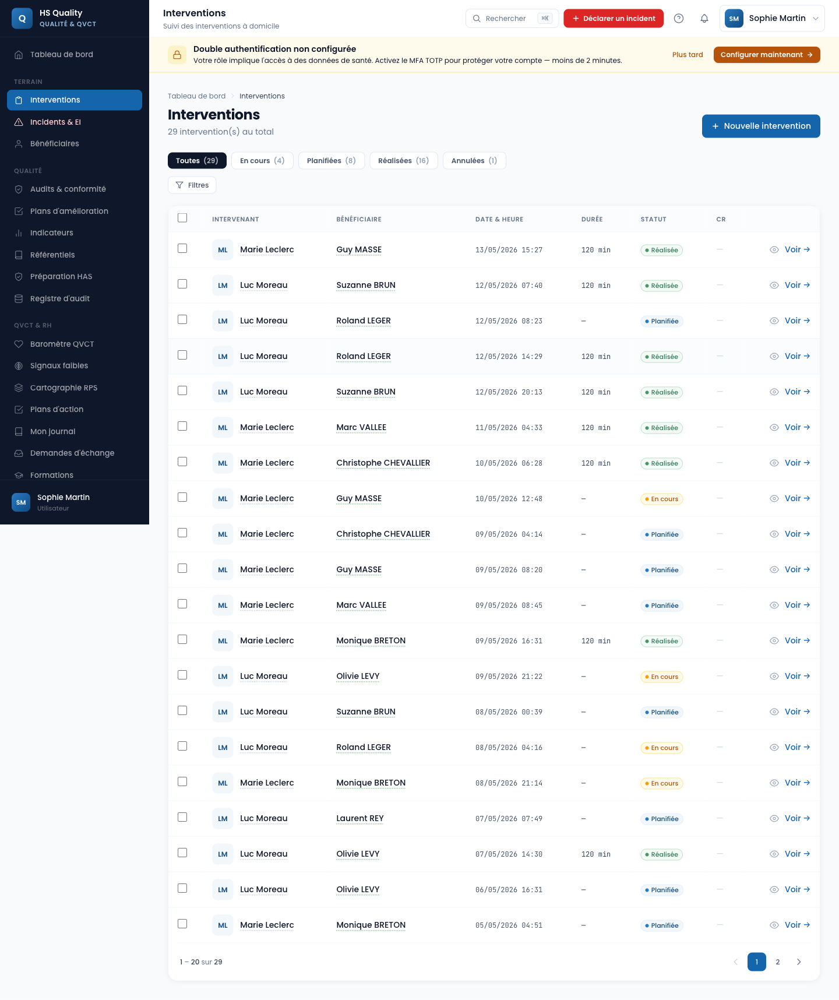

Vue agenda + vue temps réel "aujourd'hui" : couleurs par statut (planifié / en cours / terminé / en retard / manqué). **Reverb WebSocket** pour rafraîchissement instantané sans rechargement. Drag-and-drop pour replanifier. Bulk assignment pour créer un motif récurrent hebdomadaire.

### 10.5 Détail d'une intervention

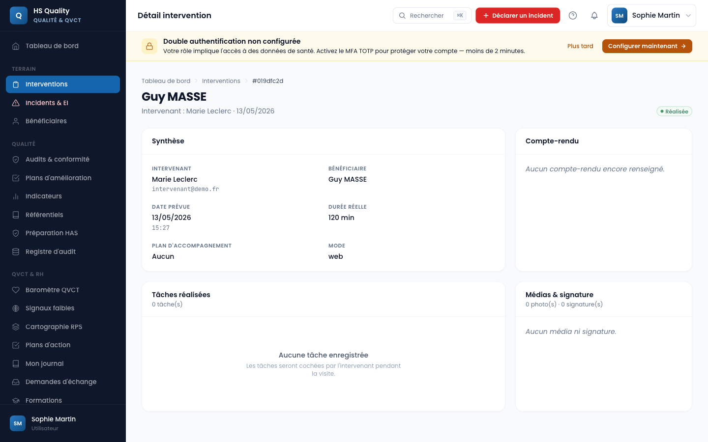

Bénéficiaire, intervenant, horaires planifié vs. réel, coordonnées GPS de check-in sur carte statique, **liste des tâches** (préremplies par le plan, cochées par l'intervenant mobile), rapport texte ou transcription voix, photos avec URL signée S3 (expiration 1 h), signature manuscrite du bénéficiaire. Le Coordinateur peut corriger ou supplémenter le rapport (toute correction est tracée dans l'audit log).

### 10.6 Liste des incidents

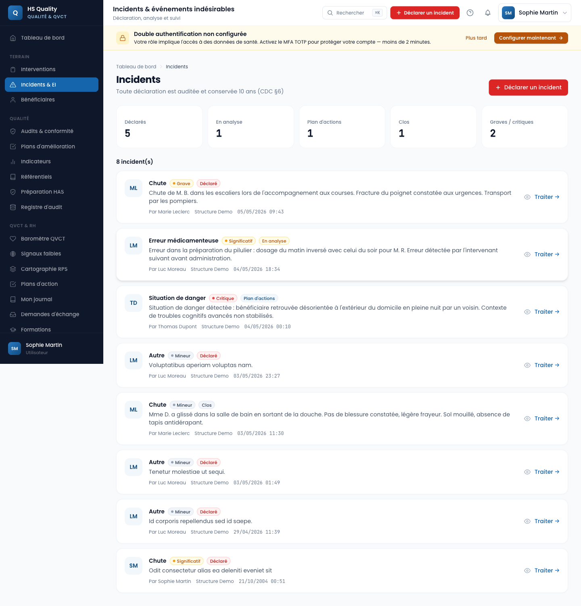

Filtrage par statut (déclaré / en analyse / plan d'actions / clos), gravité (mineur / significatif / grave / critique), catégorie (chute, agression, erreur médicamenteuse, maltraitance suspectée, situation de danger, autre), date, intervenant, bénéficiaire. Badge de comptage (ouverts, en analyse, à clôturer). Export CSV / PDF pour l'ARS.

### 10.7 Déclaration d'incident

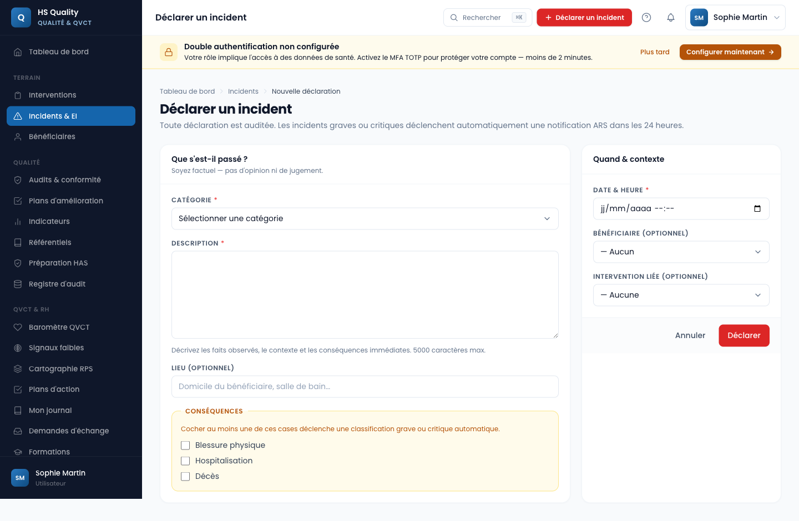

Formulaire pensé pour être complétable en < 2 minutes au chevet (exigence CDC §4.2 reportée également sur le mobile) : qui, quand, où, catégorie, description courte, blessure physique oui/non, hospitalisation oui/non. La **gravité est classifiée automatiquement** par `GraviteClassifier` (fonction pure) — surclasse-able par le Coordinateur avec justification stockée. Si gravité ≥ grave → e-mail de notification ARS déclenché en background.

### 10.8 Fiche incident — analyse 5-pourquoi

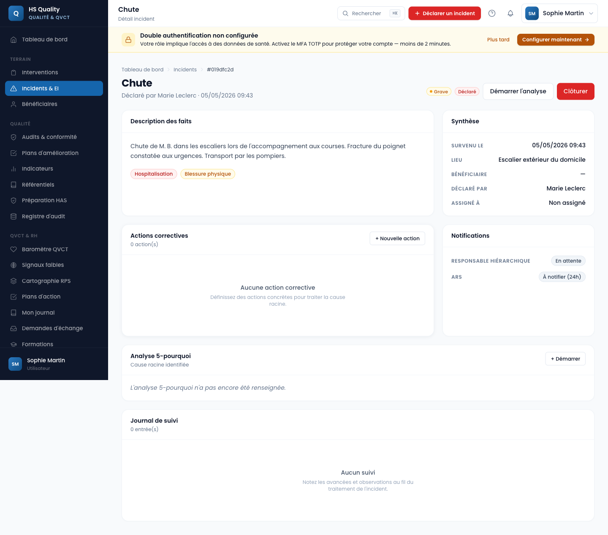

Cycle de vie complet de l'incident, persistant pour audit :
1. **Déclaration** — qui, quoi, quand, où, catégorie, gravité initiale, description
2. **Analyse 5-pourquoi** — questions guidées spécifiques à la catégorie (questions différentes pour une chute vs une erreur médicamenteuse). La **cause racine** est obligatoire pour passer au plan d'actions.
3. **Actions correctives** — CRUD avec responsable (User) et échéance ; chacune avec statut planifiée / en cours / réalisée
4. **Suivis** — notes chronologiques jusqu'à clôture
5. **Notification ARS** — si déclenchée, l'e-mail envoyé est archivé pour traçabilité

---

## 11. Rôle 4 — Référent qualité *(Tier Pro+)*

> **Compte démo** : `qualite@demo.fr` (Claire Bernard) · `password` · MFA obligatoire.

Le pilote de la démarche qualité. Conduit les audits, génère les PAC, prépare le dossier HAS. Dans une petite structure, c'est souvent le Dirigeant qui assume aussi ce rôle.

### 11.1 Liste des audits

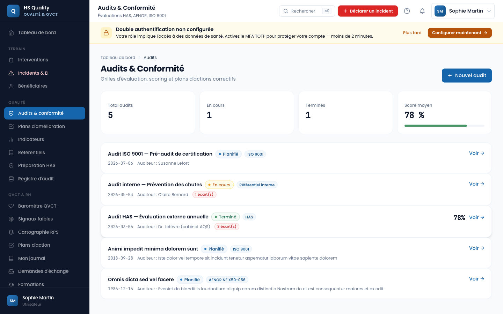

Vue d'ensemble des audits par référentiel (HAS, ISO 9001:2015, AFNOR NF X50-056, ou interne), par statut (planifié, en cours, terminé), avec score de conformité affiché. Le seed contient un audit HAS terminé (78 % avec 3 écarts), un audit interne en cours sur la prévention des chutes (1 écart critique), un pré-audit ISO 9001 planifié.

### 11.2 Création d'un audit

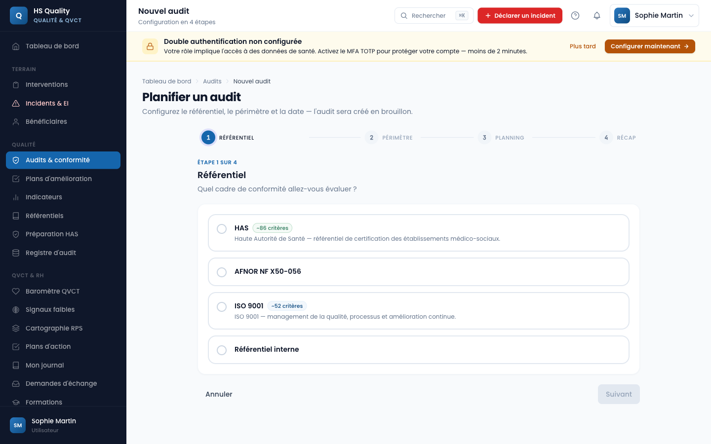

Sélection du référentiel parmi la bibliothèque, titre, description, date, auditeur (interne ou externe — ex. cabinet AQS), périmètre (lié à des bénéficiaires ou des intervenants spécifiques).

### 11.3 Bibliothèque des référentiels

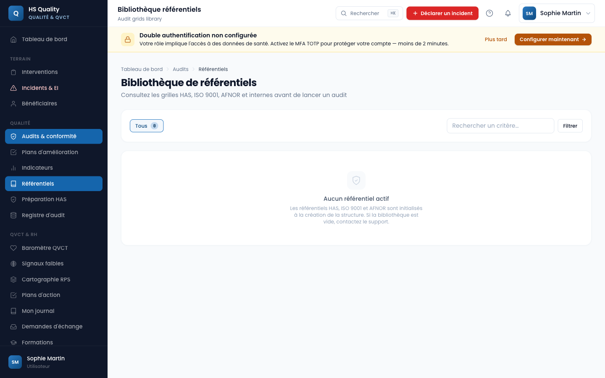

Grilles standard livrées : HAS (référentiel national d'évaluation externe), ISO 9001:2015, NF X50-056. Anatomie d'une grille : axes → sous-axes → items. Chaque item a une question, une méthode de scoring (0/1/2 ou % de conformité), un guide d'évidence. Les structures peuvent **cloner et personnaliser** une grille, ou créer une grille 100 % interne.

### 11.4 Fiche d'audit (run)

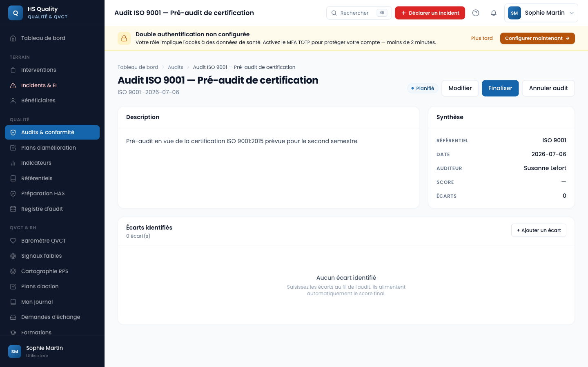

Pour chaque audit en cours : items à scorer, écarts identifiés (criticité mineur / majeur / critique), score par axe → score global. Le score est recalculé en live à chaque modification. Les écarts deviennent automatiquement les sources de PAC.

### 11.5 Plans d'amélioration continue (PAC)

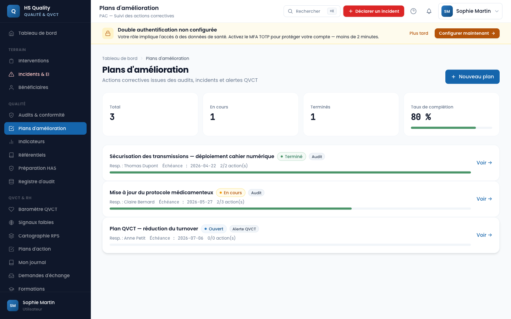

Vue par origine (audit / incident / QVCT), statut (ouvert / en cours / terminé), échéance. Le seed propose un PAC en cours pour la mise à jour d'un protocole médicamenteux (2 actions sur 3 réalisées), un PAC QVCT pour la réduction du turnover, et un PAC terminé (déploiement du cahier numérique).

### 11.6 Fiche PAC détaillée

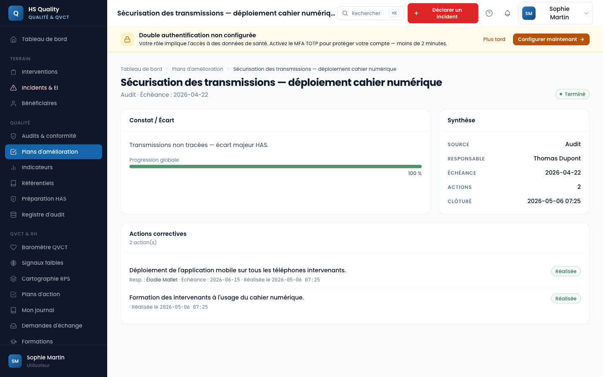

Constat, cause racine (liée au 5-pourquoi de l'incident d'origine s'il existe), liste des actions correctives (description, responsable, échéance, statut), indicateur de succès, taux d'avancement. Quand toutes les actions sont réalisées, le PAC bascule en statut "terminé" et la preuve est archivée pour l'audit suivant.

### 11.7 Guide de préparation HAS

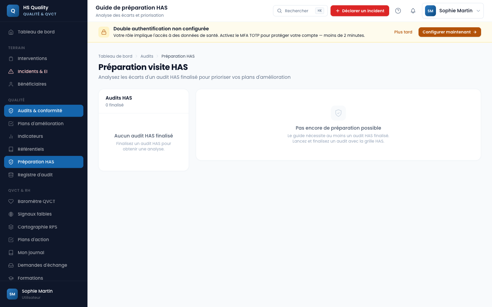

Assistant pas-à-pas pour l'auto-évaluation préalable à l'évaluation externe HAS. Couvre les 5 domaines obligatoires : (1) droits des usagers, (2) personnalisation de l'accompagnement, (3) organisation interne, (4) prévention des risques, (5) amélioration continue. Produit un **dossier téléchargeable** rassemblant preuves, écarts et plans associés. **C'est notre différenciateur produit le plus fort** pour les structures qui passent leur première certification.

---

## 12. Rôle 5 — Responsable RH / Formation *(Tier Pro+)*

> **Compte démo** : `rh@demo.fr` (Anne Petit) · `password` · MFA obligatoire.

Pilote les compétences, les habilitations et la QVCT côté collecte/exploitation. Reçoit les signaux faibles RPS.

### 12.1 Plan de formation & sessions

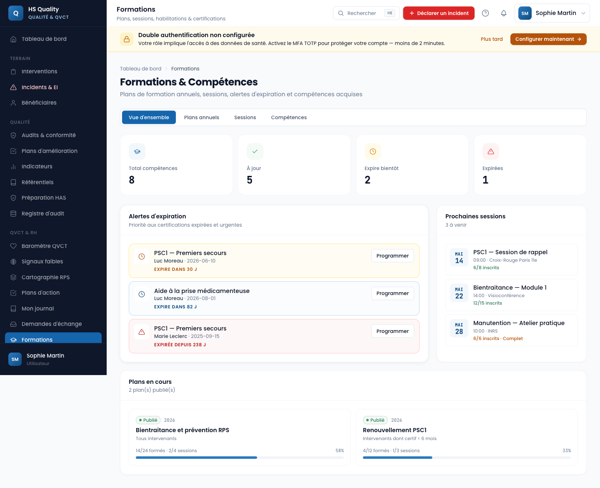

Plan annuel par structure : identification des besoins par rôle ou par individu, création de sessions (date, lieu, formateur, durée), enregistrement des présences, lien avec les certifications et compétences ciblées, export pour les demandes de financement OPCO.

### 12.2 Baromètre QVCT — vue principale

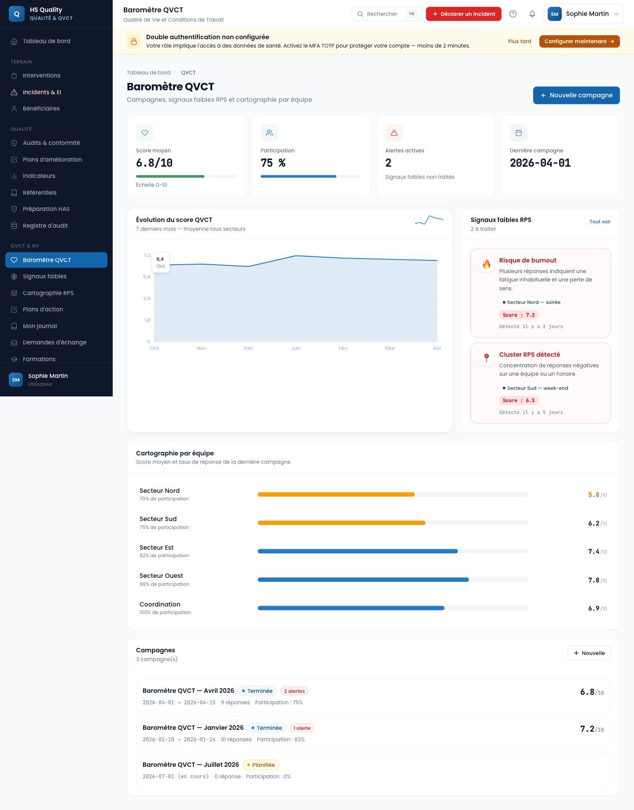

Tableau de bord QVCT : score moyen global, évolution dans le temps, taux de participation aux campagnes, comparaison entre équipes / secteurs. Les chiffres sont toujours **agrégés** — aucune réponse individuelle attribuable.

### 12.3 Campagnes — liste


Liste des campagnes de baromètre : nom, fréquence (one-shot / hebdo / mensuel / trimestriel), période, taux de participation, score moyen agrégé.

### 12.4 Création d'une campagne QVCT

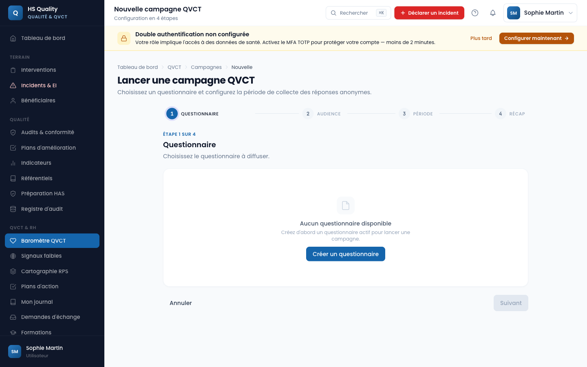

Builder de campagne : sélection ou création d'un questionnaire, périmètre (toute la structure ou des secteurs spécifiques), fréquence, dates de début/fin, calendrier de rappels. La validation déclenche l'envoi sur les mobiles des intervenants ciblés.

### 12.5 Bibliothèque de questionnaires


Modèles de questionnaires (satisfaction, charge perçue, relations équipe, sens du travail, environnement…) — clonables et adaptables. Chaque question a un type (échelle, choix multiple, texte libre) et une dimension (cartographie RPS).

### 12.6 Vue intervenant — répondre à une campagne

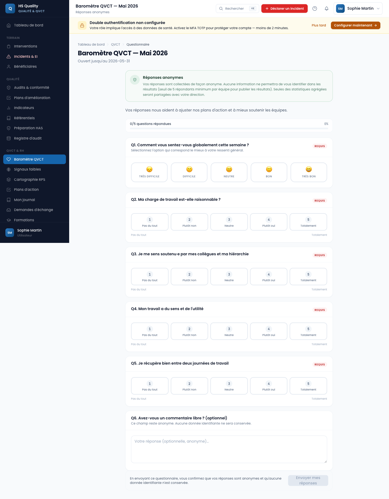

Quand une campagne est active, l'intervenant voit la fiche du questionnaire et y répond. **Aucun lien personnellement identifiable** n'est conservé entre la réponse et l'utilisateur côté collecte. Les agrégats sont calculés ensuite.

### 12.7 Signaux faibles RPS

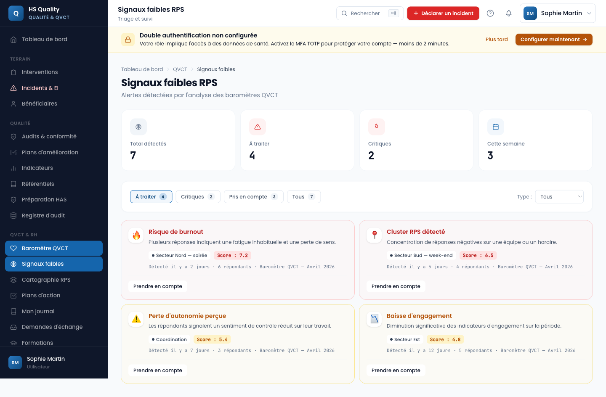

`WeakSignalDetector` (service PHP pur) analyse automatiquement chaque batch de réponses : moral moyen en baisse sur plusieurs périodes, surcharge perçue, conflits relationnels. Au franchissement de seuil → notification RH + Référent qualité **sans jamais nommer un individu** : on signale "l'équipe Nord montre un signal de surcharge", pas "Marie est en burnout".

### 12.8 Cartographie RPS / Indicateurs

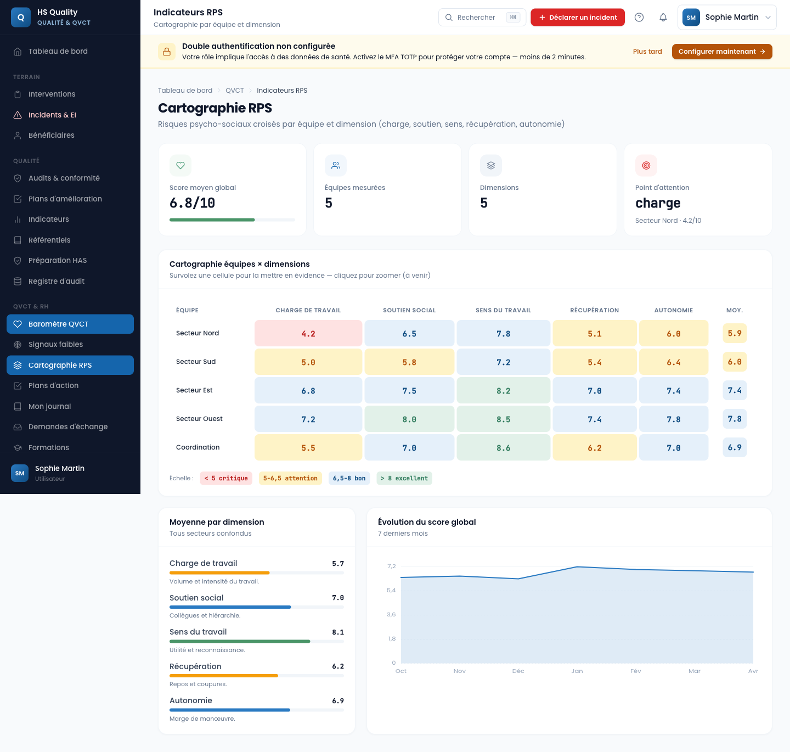

Heat-map des risques psychosociaux par équipe / secteur. Indicateurs sectoriels obligatoires (absentéisme, turnover, accidents du travail, score baromètre, surcharge). Permet au Dirigeant de prioriser ses interventions managériales.

### 12.9 Journal de bord (vue intervenant)

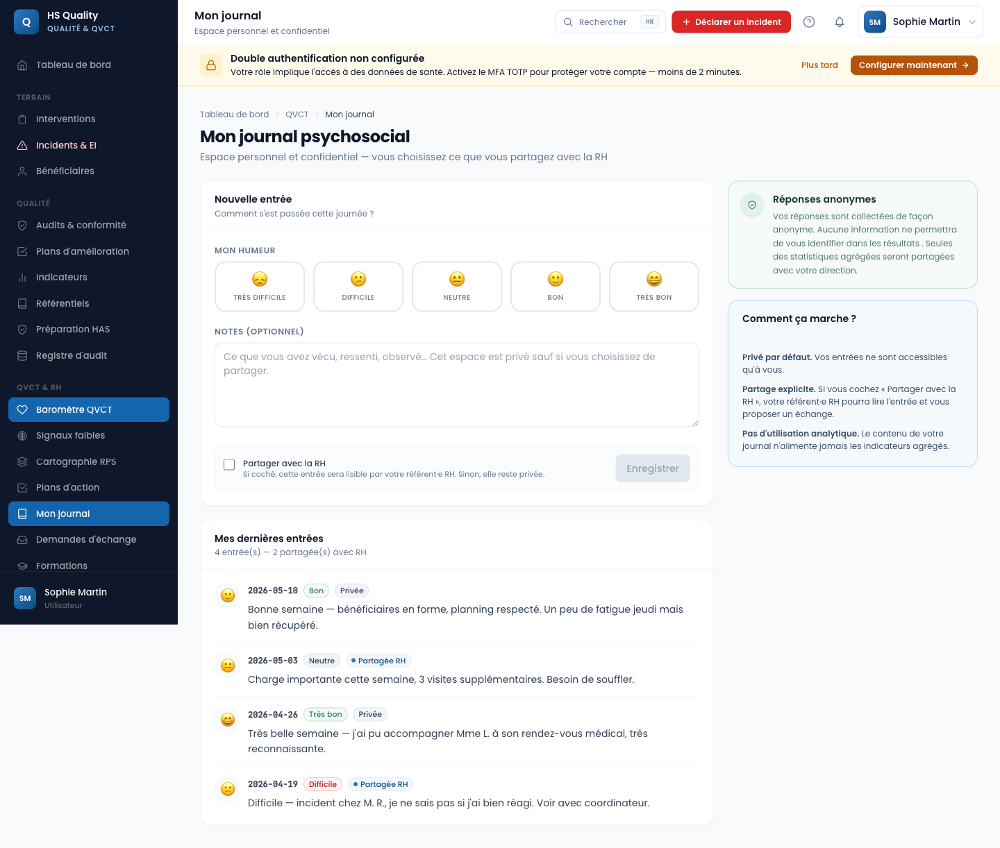

Chaque intervenant peut tenir un journal **privé** — note libre, accessible à lui seul. Côté serveur, le contenu est chiffré au repos. Sert d'exutoire structuré et de preuve si l'intervenant choisit plus tard d'ouvrir une demande d'échange.

### 12.10 Demandes d'échange

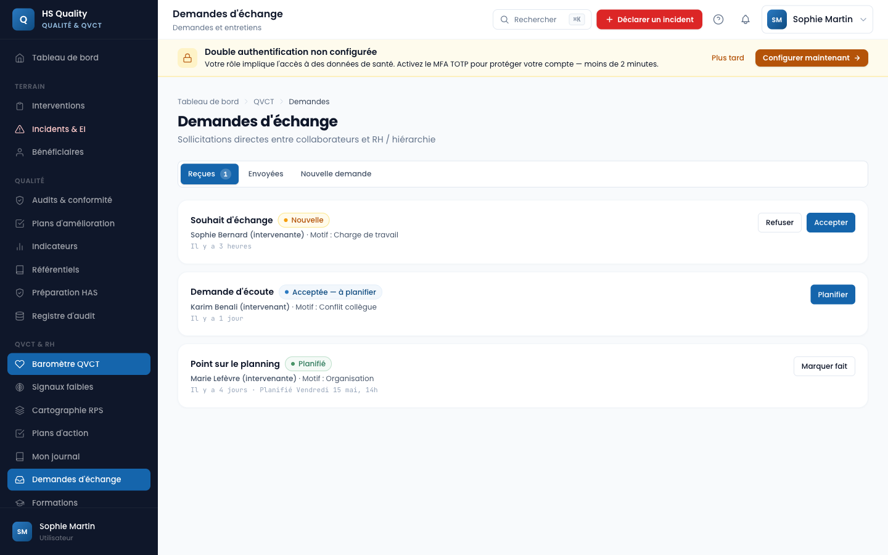

L'intervenant peut soumettre une **demande confidentielle** au RH ou au Référent qualité, qui ouvre un fil de messagerie privée. Le contenu n'apparaît jamais dans les agrégats ni dans les notifications publiques.

### 12.11 Plans d'action QVCT

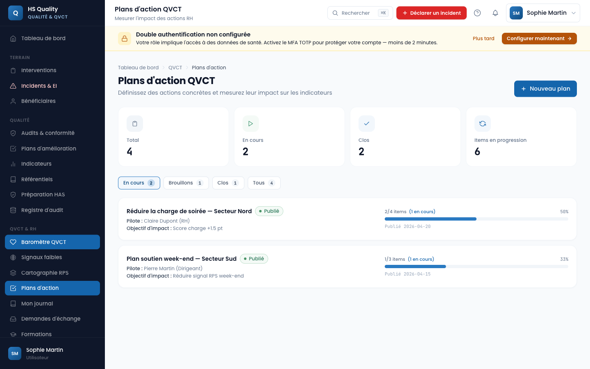

Les signaux faibles ou les scores anormaux génèrent des plans d'action QVCT spécifiques (variante des PAC dédiée à la QVCT) : actions managériales, ajustements de planning, formations, médiations. Tracking dédié dans cet écran.

---

## 13. Rôle 6 — Intervenant à domicile

> **Comptes démo** : `intervenant@demo.fr` (Marie Leclerc), `intervenant2@demo.fr` (Luc Moreau) · `password` · MFA optionnelle (biométrique sur mobile recommandée).

Le terrain. En production : application **React Native** offline-first. Le web admin l'accueille avec un périmètre **volontairement restreint**.

### 13.1 Tableau de bord intervenant

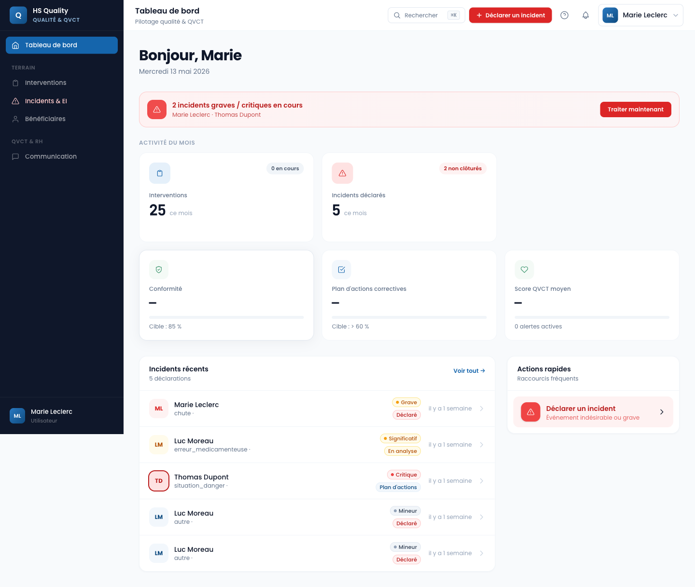

Sidebar limité à 5 entrées : Tableau de bord, Interventions, Incidents, Bénéficiaires (lecture seule), Communication. Pas d'accès aux modules qualité, QVCT (consommation côté pilote), RH, ni administration — **protection par rôle au niveau UI** (sidebar masque) + Policy + Form Request (double rempart serveur).

### 13.2 Ses interventions

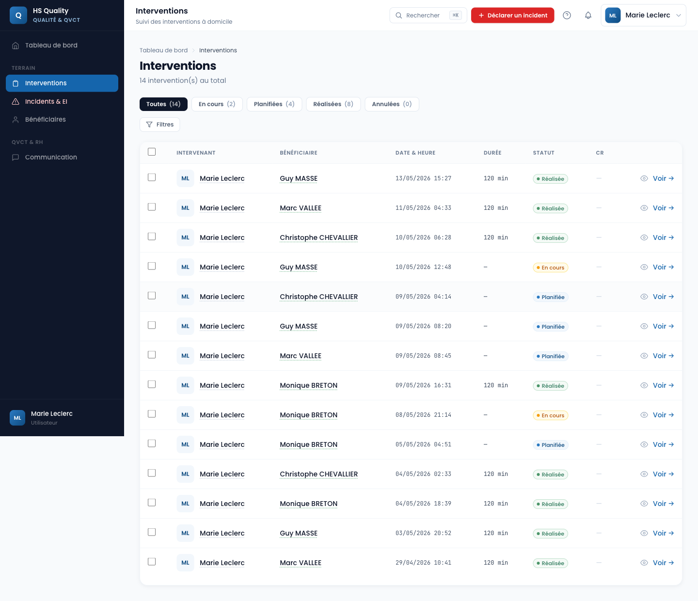

Vue filtrée automatiquement par le **global scope sur `structure_id`** + la couche `IntervenantAssignment` : il ne voit que **ses propres bénéficiaires assignés**. C'est le test cross-tenant le plus critique de la suite Pest. Si Marie tente de naviguer sur l'URL `/beneficiaries/{id}` d'un dossier non assigné, elle reçoit un 403 — le Policy refuse, le global scope ne renvoie pas la ligne en premier lieu.

### 13.3 Ses bénéficiaires (lecture seule)

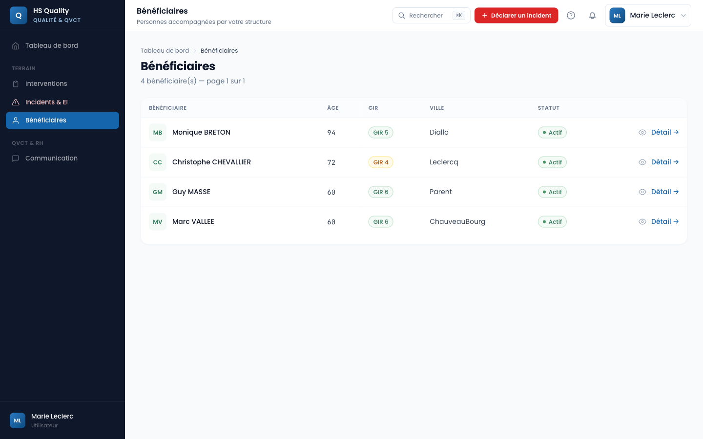

Vue lecture seule des bénéficiaires assignés. Pas de bouton "Modifier", pas de bouton "Supprimer", pas d'accès aux fiches non assignées. Le Coordinateur garde le monopole de l'édition.

### 13.4 Mes compétences & certifications

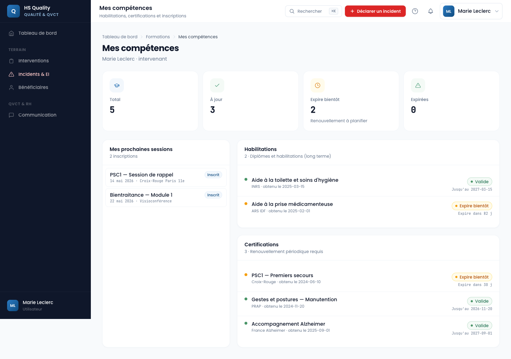

L'intervenant consulte ses habilitations actives, ses certifications avec date d'expiration (DEAVS, AES, ADVF, CQP), les sessions de formation auxquelles il a participé. Alertes visuelles à J-60 et J-30 avant l'expiration d'une certification.

### 13.5 Mon profil

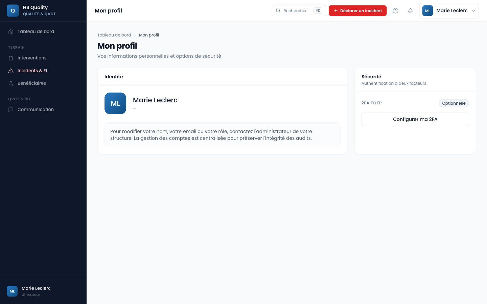

Mêmes capacités de gestion personnelle que les rôles bureau : édition profil, gestion mot de passe, configuration MFA (facultative), gestion des sessions actives. Les notifications par défaut sont calibrées pour le mobile (push silencieux).

### 13.6 Mobile React Native (non capturé — application native)

L'application mobile complète offre :

- **Tournée du jour** chronologique, offline-first via SQLite locale
- **Check-in / check-out géo-stampés** avec coordonnées GPS
- **Rapport voix-vers-texte** (transcription locale puis upload)
- **Photos** avec EXIF strippé localement avant envoi
- **Signature manuscrite** capturée à l'écran tactile
- **Déclaration d'incident** en < 2 minutes (CDC §4.2)
- **Messagerie temps réel** via Reverb (en ligne) + queue locale (hors ligne)
- **Sync différée** via `POST /api/v1/sync/batch` avec en-tête `Idempotency-Key`
- **Auto-récupération** des opérations en cas de plantage app ou perte réseau

---

## 14. Modules transverses

### 14.1 Module Communication

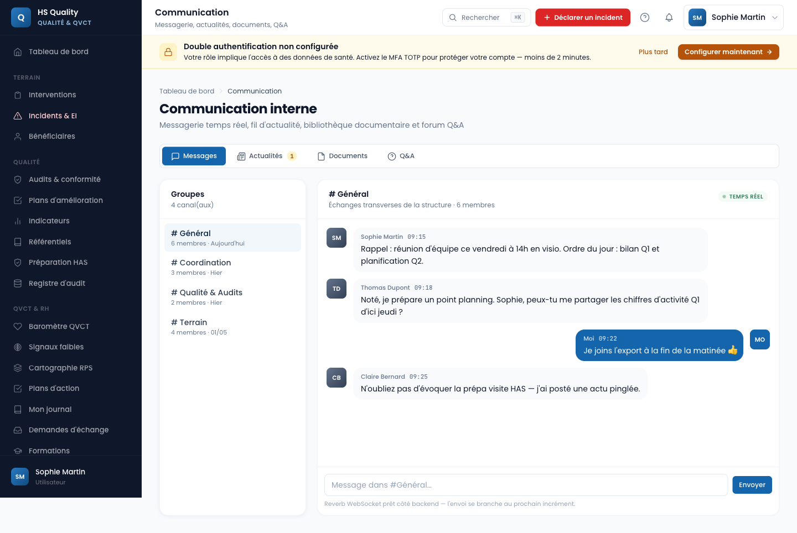

Disponible **sur tous les tiers**, web ET mobile. Comprend :

- **Messagerie 1-à-1 et groupes** — temps réel via Reverb. Un Coordinateur peut créer des groupes ("Secteur Nord", "Équipe Sophie").
- **Fil d'actualité structure-wide** — publication par les rôles bureau, lecture par tous. Supporte le texte enrichi et les pièces jointes.
- **Forum Q&R** — questions sur les protocoles, démarches, etc. Réponses des managers ou pairs.
- **Bibliothèque documentaire** — stockage S3 chiffré des protocoles, formations, formulaires admin, preuves d'audit, rapports annuels. Versioning et contrôle d'accès par rôle.

### 14.2 Module Audit log (visible Dirigeant + Référent qualité)


Trace immuable de **toute écriture sensible** (santé, QVCT, billing) : utilisateur acteur, timestamp, modèle concerné, ID, avant/après. Implémentation par `owen-it/laravel-auditing`. C'est la preuve exigible en évaluation HAS et en cas de contrôle CNIL.

---

## 15. Workflows & machines à états

### 15.1 Cycle de vie d'un incident

```
       Mobile / Web déclaration
                │
                ▼
        ┌────────────┐
        │  déclaré   │ ← gravité auto par GraviteClassifier
        └──────┬─────┘
               │ assigner à un responsable
               ▼
        ┌────────────┐    si grave/critique
        │ en_analyse │ ─────────────────────► NotifyARSJob
        └──────┬─────┘                       (mail ARS dans les 24h)
               │ remplir 5-pourquoi
               ▼
        ┌────────────────┐
        │  plan_actions  │ ← actions correctives CRUD
        └──────┬─────────┘
               │ toutes les actions réalisées
               ▼
        ┌────────────┐
        │    clos    │ — archivé, preuve audit
        └────────────┘
```

### 15.2 Cycle de vie d'un audit

```
planifié → en_cours → terminé (score figé, écarts gelés)
                  │
                  └──► génération automatique d'un PAC
                       pour chaque écart majeur ou critique
```

### 15.3 Cycle de vie d'un PAC

```
ouvert → en_cours → terminé (toutes actions réalisées)
                  ↘ abandonné (justification obligatoire)
```

### 15.4 Cycle de vie d'un abonnement

```
provisionné → trialing (30j Essentiel par défaut)
            ↓
          active (charged monthly, Stripe)
            ↓
          cancel → grace_period (jusqu'à fin de période payée)
            ↓
          data_retained_30d → purge définitive
```

---

## 16. Sécurité approfondie & conformité

### 16.1 Multi-tenancy — row-level

| Mécanisme | Détail |
|-----------|--------|
| Colonne `structure_id` | UUID FK sur **chaque** table métier |
| Trait `BelongsToStructure` | Global scope Eloquent — toute requête est filtrée auto par `structure_id = current_structure.id` |
| `BasePolicy::before()` | Deuxième barrière : refuse l'accès à tout modèle dont `structure_id ≠ user.structure_id` |
| `CrossTenantQueryService` | **Seul** endroit autorisé à écrire des requêtes inter-tenant. Code review explicite + logging. Utilisé uniquement pour le benchmark sectoriel anonymisé (Phase 3). |
| Test Pest obligatoire | Pour chaque modèle, un test crée deux structures, requête depuis l'une vers l'autre, et assert que zéro ligne ne fuit |

### 16.2 Authentification & MFA

| Surface | Mécanisme |
|---------|-----------|
| Web | Session cookie HTTP-only · Laravel Fortify · CSRF token Inertia |
| API mobile | Sanctum personal access tokens · stockés dans le keychain device |
| MFA office | TOTP (RFC 6238) **obligatoire** · Authenticator app · codes de récupération |
| MFA terrain | Optionnel · biométrie device recommandée |
| **Rejetés** | SMS OTP (SIM-swap) · email OTP (compromission boîte) |
| Re-auth | Confirmation de mot de passe avant opérations sensibles (billing, suppression utilisateur) |

### 16.3 Sécurité des données

| Concern | Implémentation |
|---------|----------------|
| **Chiffrement repos** | S3 SSE-KMS pour fichiers · PostgreSQL colonnes chiffrées (notes médicales, allergies, instructions) |
| **Chiffrement transit** | TLS 1.2+ partout · HSTS forcé en production · TLS 1.3 préféré |
| **Headers sécurité** | CSP, X-Frame-Options, X-Content-Type-Options, Referrer-Policy, Permissions-Policy sur chaque réponse |
| **Photos** | EXIF strippé + ré-encodage Intervention Image (extension PHP `gd` requise) avant S3 |
| **URLs signées** | Photos servies via S3 signed URL, expiration 1 h |
| **Validation** | 100 % des écritures via Form Request `authorize()` — jamais inline contrôleur |
| **Injection** | Eloquent ORM exclusif · raw SQL banni sauf `CrossTenantQueryService` review |
| **Rate limiting** | Per-user + per-IP · plus strict sur auth (5 tentatives/min/IP, blocage 15 min) |
| **CSRF** | Token Inertia + cookie XSRF-TOKEN |
| **XSS** | Échappement par défaut Blade ET React · pas de `{!! !!}` ni `dangerouslySetInnerHTML` |
| **Audit log** | `owen-it/laravel-auditing` sur chaque écriture santé/QVCT/billing |

### 16.4 RGPD & HDS

| Exigence | Mise en œuvre |
|----------|--------------|
| **HDS** | Hébergement AWS Paris (eu-west-3) ou OVHcloud France — tous deux certifiés HDS |
| **Consentement** | Horodaté à la création du bénéficiaire, version conservée |
| **Droit d'accès** | Export PDF / JSON du dossier complet d'un bénéficiaire |
| **Droit à l'effacement** | `BeneficiaireService::anonymize()` — pseudonymisation préservant les agrégats statistiques |
| **Conservation** | Données métier conservées 5 ans après dernière intervention (conformité HAS) ; logs MFA / audit conservés 3 ans |
| **Sous-traitants** | Stripe (paiement) · AWS (HDS) · Sentry (erreurs, sans PII) — DPA signés |

### 16.5 Pré-commit & CI

| Étape | Outil | Bloquant ? |
|-------|-------|------------|
| Format PHP | Pint | Oui sur PR |
| Syntaxe PHP | `php -l` | Oui |
| Named individual leak guard | Lefthook hook custom | Oui (anti-fuite identité) |
| Tests Pest unitaires + fonctionnels | Pest | Oui sur PR |
| Audit dépendances | `composer audit` | Oui sur push |
| Larastan | Larastan | Warning en CI |
| Types TypeScript | tsc | Oui sur PR |
| Tests cross-tenant leak | Pest | Oui sur PR |

---

## 17. Modèle commercial

### 17.1 Pricing & contenu des tiers

| Tier | Prix / intervenant / mois | Modules unlocked |
|------|---------------------------|-----------------|
| **Essentiel** | 8 € | Traçabilité interventions, bénéficiaires, plans d'accompagnement, incidents, dashboard de base, mobile, messagerie |
| **Pro** | 15 € | + Baromètre QVCT, audits HAS/ISO/AFNOR, PAC, préparation HAS, fil d'actualité étendu, formations, habilitations, certifications |
| **Premium** | 25 € | + IA prédictive (burnout, perte d'autonomie), portail bénéficiaire/famille, benchmark sectoriel anonymisé, reporting annuel PDF auto |

**Trial** : 30 jours d'essai gratuit Essentiel · pas de CB demandée à l'inscription · CB demandée pour passer Pro/Premium ou continuer après J+30.

**Annulation** : self-service depuis la page Abonnement. Accès maintenu jusqu'à fin de période payée (grace period), puis 30 jours de rétention des données avant purge définitive. Re-souscription pendant la rétention = restauration intégrale.

### 17.2 Stack billing

- **Stripe** — paiements, abonnements, factures, Stripe Tax pour la TVA française
- **Laravel Cashier v16** — `Structure` est l'entité billable (pas l'utilisateur individuel)
- **Webhook Stripe** — `POST /stripe/webhook` (route built-in Cashier) ; idempotent
- **Listener `SyncSubscriptionToStructure`** — synchronise `structures.tier` à chaque événement subscription

### 17.3 Trajectoire revenus (CDC §7.3)

| Phase | Structures | Intervenants | ARR (estimation Pro) |
|-------|-----------|-------------|---------------------|
| Phase 1 *(MVP — fait)* | 10 | 200 | ~36 K€ |
| Phase 2 *(Qualité Pro — en cours)* | 50 | 1 000 | ~180 K€ |
| Phase 3 *(IA Premium)* | 200 | 5 000–15 000 | ~0,9–2,7 M€ |
| Phase 4 *(National)* | 500 | 12 500–37 500 | ~2,25–6,75 M€ |
| Phase 5 *(Europe)* | 3 000 | 75 000+ | ~18 M€ cible |

---

## 18. Stack technique consolidée

| Couche | Techno | Version | Statut |
|--------|--------|---------|--------|
| Backend framework | Laravel | 12 | ✅ |
| Langage backend | PHP | 8.2+ (8.4 dev) | ✅ |
| DB | PostgreSQL | 16 | ✅ |
| Cache / queue | Redis | 7 | ✅ |
| Web front-end | Inertia | v2 | ✅ |
| UI lib | React | 19 | ✅ |
| Type checking | TypeScript | 5.x | ✅ |
| Styling | Tailwind CSS | v4 (CSS-first) | ✅ |
| Type-safe routes | Wayfinder | v0 | ✅ |
| Mobile front-end | React Native | offline-first | 🔄 |
| API | REST `/api/v1/*` + Sanctum + Scramble OpenAPI | — | ✅ |
| Realtime | Laravel Reverb (WebSocket) | v1 | ✅ |
| Storage | S3 (AWS Paris / OVH) SSE-KMS | — | ✅ |
| Auth | Fortify (web) + Sanctum (mobile) + TOTP | — | ✅ |
| RBAC | Spatie Permission team-scoped | v6 | ✅ |
| Audit | owen-it/laravel-auditing | v14 | ✅ |
| Feature flags | Laravel Pennant | v1 | ✅ |
| Billing | Stripe + Cashier | v16 | ✅ |
| Tests | Pest | v3 (cross-tenant leak obligatoire) | ✅ |
| Error tracking | Sentry | — | ✅ |
| Static analysis | Larastan | v3 | ✅ |
| Code style | Pint | v1 | ✅ |
| Pre-commit | Lefthook | — | ✅ |
| IA (Ph. 3) | Python microservice (sklearn + LLM) | — | ⏳ |

---

## 19. Roadmap & état d'avancement

### 19.1 Phase 0 — Foundations (3 semaines) — ✅ Fait

Infrastructure, tooling, multi-tenancy scaffold, RBAC fondation, audit logging, CI/CD, lefthook, infra HDS-ready.

### 19.2 Phase 1 — MVP (M1–M4, target 10 structures) — ✅ Fait, 10 pilotes onboardés

| Module | Description |
|--------|-------------|
| **M1** | Bénéficiaires & plans d'accompagnement |
| **M2** | Traçabilité interventions (check-in/out, rapports, photos, signatures, temps réel Reverb) |
| **M3** | Gestion des incidents (déclaration, auto-classification, ARS, 5-pourquoi, actions correctives, clôture) |
| **M7** | Dashboard basique (KPI tiles, vue opérationnelle) |
| **M4** | API REST complète, app mobile RN skeleton, protocole sync offline |

### 19.3 Phase 2 — Qualité / Pro (M5–M8, target 50 structures) — 🔄 Backend ✅, frontend en finalisation

| Module | Description | Statut |
|--------|-------------|--------|
| **C1–C7** | Stripe/Cashier, webhook idempotent, onboarding, lifecycle complet, tests Pest | ✅ |
| **M3** | QVCT baromètre, signaux faibles, RPS, journal, demandes d'échange, indicateurs, cartographie | ✅ backend, 🔄 front |
| **M6** | Audits HAS/ISO/AFNOR, exécution mobile, auto-scoring, génération PAC, guide HAS | ✅ backend, 🔄 front |
| **M4** | Messagerie temps réel, groupes, fil, Q&R, bibliothèque documentaire | ✅ backend, 🔄 front |
| **M5** | Habilitations, certifications, plans de formation, présences | ✅ backend, 🔄 front |

**Sprints frontend récents** :
- Sprint 1–5 : foundations UI (sidebar, layouts, dashboard, listes, formulaires, états vides)
- Sprint 6 : Pest tests, Wayfinder regen, QVCT builder, Echo client
- Sprint 7 : grilles d'audit, préparation HAS, détails formation, préférences profil

### 19.4 Phase 3 — IA & Data / Premium (M9, target 200 structures) — ⏳ À venir

- **M9 IA prédictive** : microservice Python (sklearn + LLM) pour risque burnout, perte d'autonomie, analyse sémantique des rapports d'intervention
- **M8 Portail bénéficiaire/famille** : app PWA séparée, accès lecture aux soins reçus
- **Benchmark anonymisé** : comparaison sectorielle (via `CrossTenantQueryService`)
- **Reporting auto** : génération PDF du rapport qualité annuel

### 19.5 Phase 4 — Expansion nationale (target 500 structures)

- API connecteurs logiciels de planning (HumanGo, Apologic, etc.)
- Licences institutionnelles ARS / Conseils Départementaux
- Programme partenaires intégrateurs avec sandbox

### 19.6 Phase 5 — Expansion européenne (target 3 000 structures, ARR 18 M€)

- Multi-pays : Belgique, Suisse, Luxembourg
- Résidence des données par pays
- Localisation Néerlandais (Flandre), Allemand (Suisse)

---

## 20. Comptes de démonstration

> Tous les comptes ont le mot de passe `password`. MFA est désactivée en environnement local (`REQUIRE_MFA_ENROLLMENT=false` dans `.env`) — **obligatoire en production**.

### 20.1 Structure DEMO

| E-mail | Nom | Rôle |
|--------|-----|------|
| `admin@platform.fr` | Platform Admin | Plateforme (hors tenant) |
| `dirigeant@demo.fr` | Sophie Martin | Dirigeant |
| `coordinateur@demo.fr` | Thomas Dupont | Coordinateur |
| `qualite@demo.fr` | Claire Bernard | Référent qualité |
| `rh@demo.fr` | Anne Petit | Responsable RH |
| `intervenant@demo.fr` | Marie Leclerc | Intervenant |
| `intervenant2@demo.fr` | Luc Moreau | Intervenant |

### 20.2 Structures secondaires (vue Platform Admin)

| E-mail | Structure | Détail |
|--------|-----------|--------|
| `dirigeant.soleil@demo.fr` | Soleil de Provence | SAAD Pro · actif · incident grave seed |
| `dirigeant.nord@demo.fr` | Nord Santé Soins | SSIAD Premium · actif |
| `dirigeant.mainsdor@demo.fr` | Mains d'Or — CCAS | CCAS Essentiel · **suspendu** |

### 20.3 Données seedées

- **34 bénéficiaires** (8 DEMO + 26 sur les structures secondaires)
- **104 interventions** (statuts variés : planifié, en cours, terminé, annulé)
- **5 plans d'accompagnement** (statuts variés : actif, brouillon, archivé)
- **15 incidents** (mineur clos, significatif en analyse, grave hospitalisé, critique avec PAC, + minor batch)
- **5 audits** (HAS terminé 78 %, interne en cours, ISO 9001 planifié, + secondaires)
- **3 PAC** (en cours déploiement protocole médicamenteux, ouvert QVCT turnover, terminé cahier numérique)

### 20.4 Lancer en local

```bash
# 1. Installer
composer install && npm install
npx lefthook install

# 2. Configurer
cp .env.example .env
php artisan key:generate
# Renseigner DB_DATABASE, AWS_BUCKET, STRIPE_KEY, etc.

# 3. Migrer + seed
php artisan migrate:fresh --seed

# 4. Lancer dev
composer run dev  # serve + queue + pail + vite

# 5. Connexion
# Ouvrir http://localhost:8000/login
# Cliquer "Remplir avec les identifiants démo"
```

---

## 21. Take-aways

1. **Un seul backend, deux fronts.** Le code métier vit dans `app/Services/*` — jamais dupliqué entre Inertia et REST.

2. **Sécurité par défaut, pas en option.** Tenancy + Policy + Form Request + audit log à chaque écriture, vérifié à chaque PR par le pré-commit lefthook et la CI.

3. **MFA santé strict.** TOTP only. SMS et e-mail OTP refusés conformément aux recommandations ANSSI / CNIL santé.

4. **HAS-natif.** L'assistant de préparation HAS est intégré au cœur du produit — pas un add-on. C'est notre différenciateur produit le plus tangible vs concurrence sectorielle.

5. **QVCT anonymisée.** Aucune réponse intervenante n'est attribuable, ni par le RH ni par le Dirigeant. Les signaux faibles sont détectés sans nommer personne.

6. **Multi-tenant strict.** Row-level + Policy + test cross-tenant obligatoire en CI. La fuite cross-tenant est tout simplement impossible à committer sans casser la build.

7. **Mobile offline-first.** L'intervenant peut bosser 8 h en zone blanche, le sync ré-applique tout proprement à la reconnexion via `Idempotency-Key`.

8. **Roadmap claire.** Phases 1 & 2 livrées (50 captures de cette présentation en témoignent), Phase 3 IA prête à démarrer, Phase 5 Europe à l'horizon 18 mois pour 18 M€ ARR cible.

---

*Présentation générée à partir des 50 captures Playwright du 2026-05-13 (branche `feature/front`) — tous les écrans projetés sont fonctionnels en local sur `http://127.0.0.1:8000`.*
